# Usage

How to use the Ion Nutri application to generate nutritional reports.

## Quick Start

1. **Make sure the application is running**
   ```bash
   docker-compose ps
   # All services should be "Up"
   ```

2. **Access the Frontend**
   - Open: http://localhost:3001
   - User-friendly interface for generating reports

3. **Access interactive documentation**
   - Open: http://localhost:8000/docs
   - Use the Swagger interface to test the API directly

## Generating Reports via Frontend

The easiest way to generate reports is through the web interface at **http://localhost:3001/**.

### How to Use

**Step 1: Navigate to Create Report**

Access the home page and click on "Create New Report" button:


**Step 2: Select Anamnesis Type**

Choose between two workflows:
- **IonNutri**: Comprehensive nutritional assessment including family history and environmental factors for detailed metabolic analysis
- **VidaNova**: Performance and fitness-focused analysis with emphasis on muscle gain goals and nutritional planning

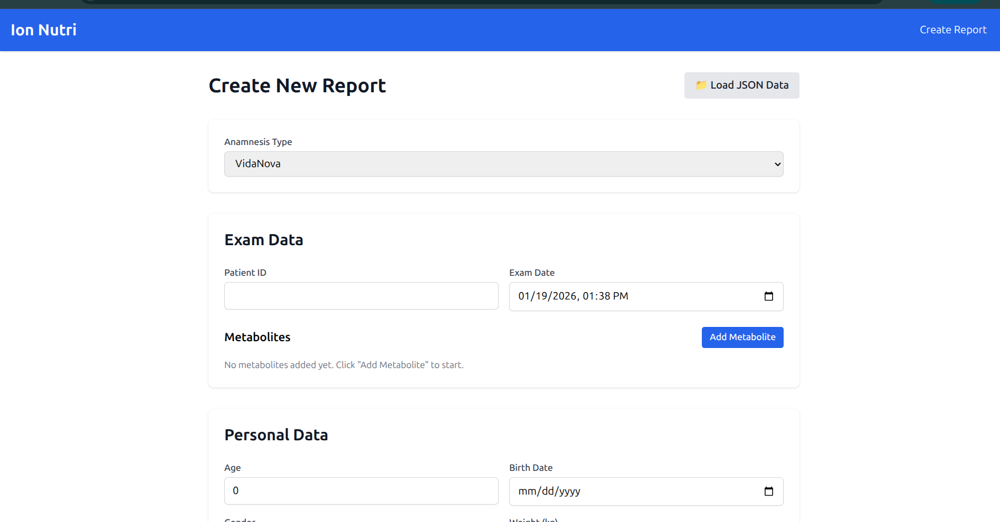

**Step 3: Fill Report Data**

You have two options to populate the report:

**Option A: Load JSON Data**

Click on "Load JSON Data" button to upload a pre-formatted JSON file with all exam and anamnesis information.

**Option B: Manual Input**

Fill the form manually with your data:

- **Exam Data**: Patient ID, exam date, and metabolite values
- **Personal Data**: Age, birth date, gender, weight, height
- **Supplements**: Add any supplements the patient is taking
- **Anamnesis Type Specific Information**: Additional fields based on the selected type (Diet Type, Energy Level, Muscle Gain Goals, etc.)

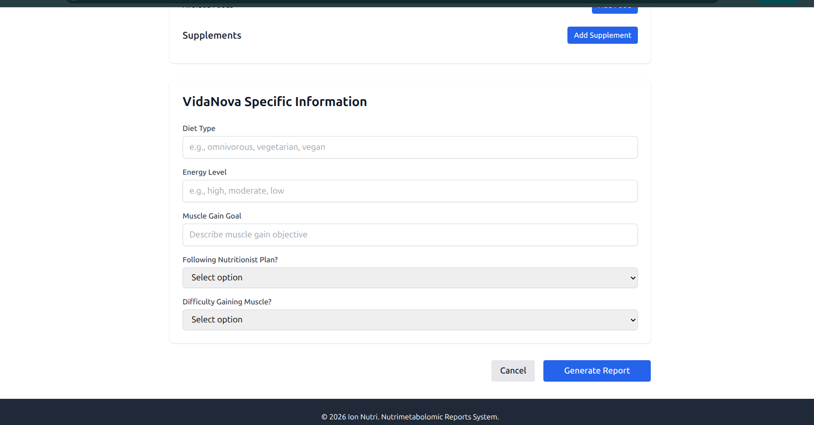

**Step 4: Generate Report**

Click the "Generate Report" button at the bottom of the form. The system will process your data and show a progress dialog:

- **IonNutri reports**: ~5 minutes estimated time
- **VidaNova reports**: ~3 minutes estimated time

The progress bar and elapsed time will help you track the generation process.

**Step 5: View Generated Report**

Once complete, you'll be redirected to the report view with all the analysis and recommendations.

## Generating Reports via API

To facilitate testing, use real data already included in the project:

### Available Files

**Vida Nova (vidanova):**
```bash
backend/app/scripts/load_data/data_to_pass_api/vidanova/complete_data/
├── PP001.json  # Patient 001
├── PP020.json  # Patient 020
└── PP032.json  # Patient 032
```

### How to Use Data in API

1. **Access**: http://localhost:8000/docs
2. **Open**: `POST /api/v1/reports/`
3. **Copy the content** of a sample file:
   - **For Vida Nova data**: Use `PP001.json`, `PP020.json`, or `PP032.json`
   - **Example command**:
     ```bash
     cat backend/app/scripts/load_data/data_to_pass_api/vidanova/complete_data/PP001.json
     ```
4. **Paste the entire JSON** in the API request body field
5. **Execute** to generate real report!

### Via CLI with CURL

You can also test the API directly from command line:

**Using sample files:**
```bash
# Test with Vida Nova patient PP001 (with explicit exam_type)
curl -X POST "http://localhost:8000/api/v1/reports/?exam_type=vidanova" \
  -H "Content-Type: application/json" \
  -d @backend/app/scripts/load_data/data_to_pass_api/vidanova/complete_data/PP001.json

# Test with patient PP020 (using default - exam_type from anamnesis)
curl -X POST "http://localhost:8000/api/v1/reports/" \
  -H "Content-Type: application/json" \
  -d @backend/app/scripts/load_data/data_to_pass_api/vidanova/complete_data/PP020.json
```

**Note:** The `exam_type` parameter is optional. If not provided, the system uses the `anamnesis_type` value from the JSON data. Available options: `ionnutri`, `vidanova`.

**Manual JSON (simple example):**
```bash
curl -X POST "http://localhost:8000/api/v1/reports/" \
  -H "Content-Type: application/json" \
  -d '{
    "exam_data": {
      "patient_id": "TEST_001",
      "exam_date": "2024-01-15T10:00:00",
      "metabolites": [
        {"name": "Glucose", "value": 95.5},
        {"name": "Cholesterol", "value": 180.2}
      ]
    },
    "anamnesis": {
      "anamnesis_type": "ionnutri",
      "patient_id": "TEST_001",
      "personal_data": {
        "age": 35,
        "gender": "female",
        "weight": 65.0,
        "height": 1.65
      },
      "physical_activity": {
        "frequency": "3x per week",
        "type": "aerobic",
        "intensity": "moderate"
      },
      "sleep": {
        "duration": 7.5,
        "quality": "good"
      },
      "medical_history": {
        "chronic_diseases": [],
        "medications": [],
        "allergies": []
      },
      "dietary_habits": {
        "meal_frequency": 4,
        "water_intake": 2.0,
        "dietary_restrictions": []
      }
    }
  }'
```

**Usage example:**

**Step 1**:

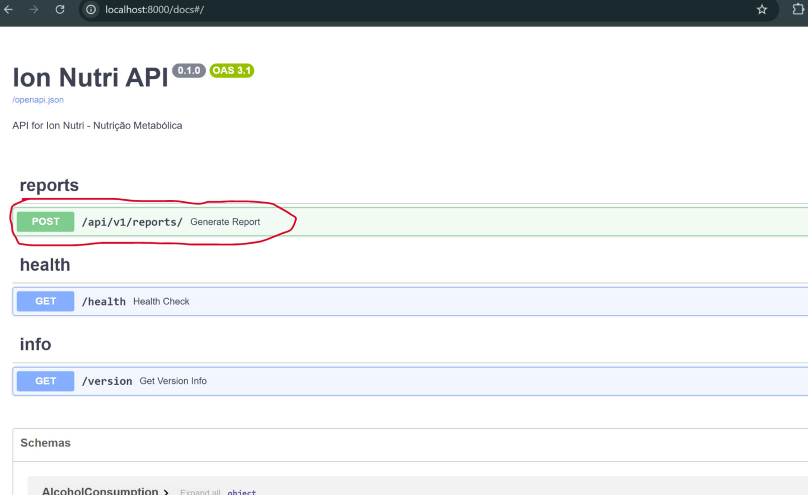

**Step 2**:

You can choose the parameter "ionnutri" or "vidanova" depending on the type of data you're using.

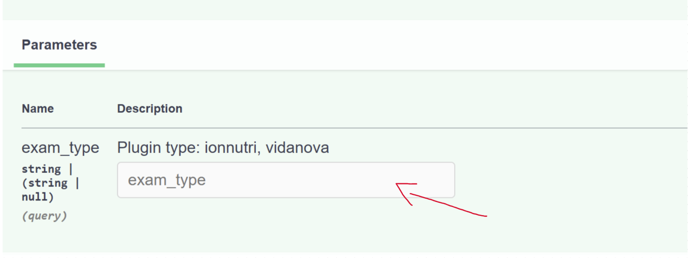

**Step 3**:

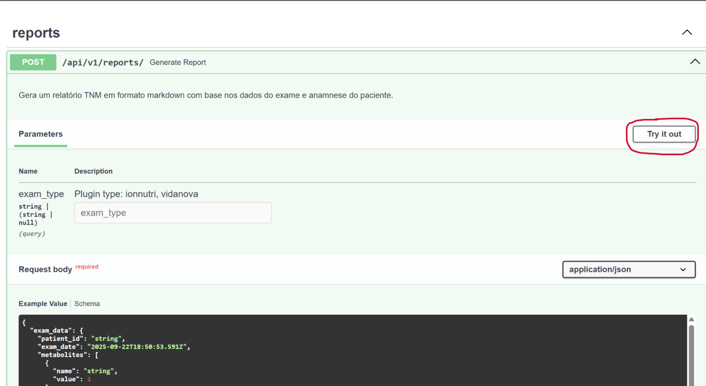

**Step 4**:

The report generation may take a few seconds. While waiting, you can observe the logs with the following command:
```bash
docker logs ion-nutri-api -f
```

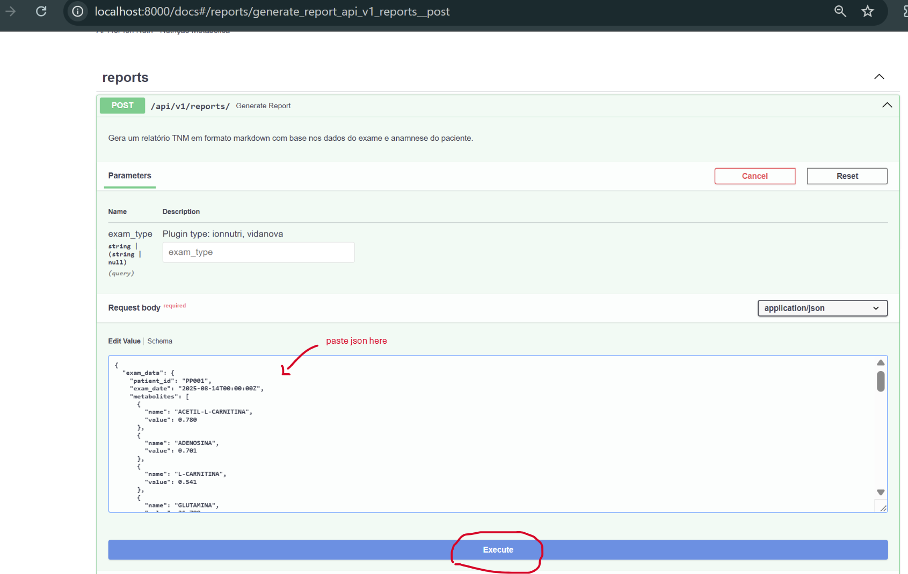

**Step 5**:

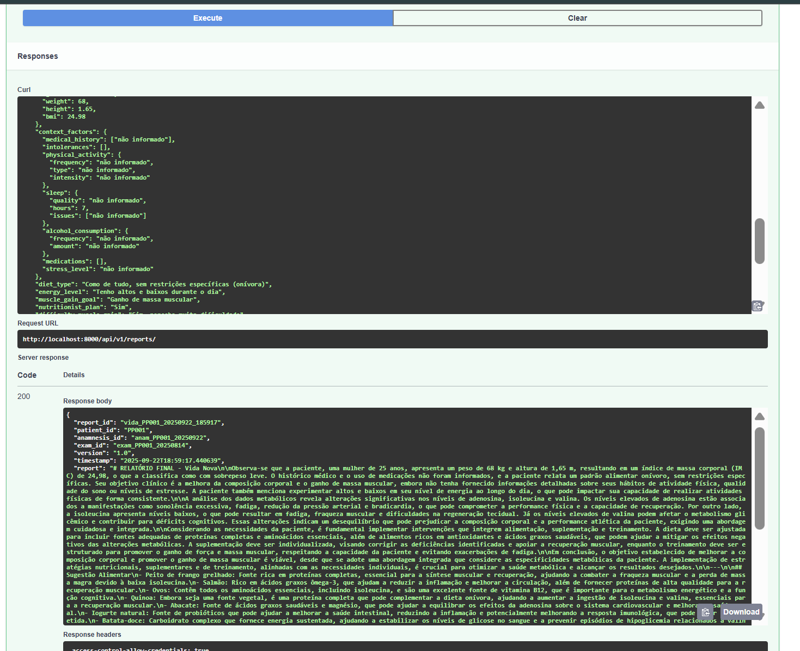


## Monitoring

### MLflow (Tracking)
- **URL**: http://localhost:5000
- **Function**: Track executions
- **View**: History of generated reports

Steps to follow to find the reports:

**Step 1:**

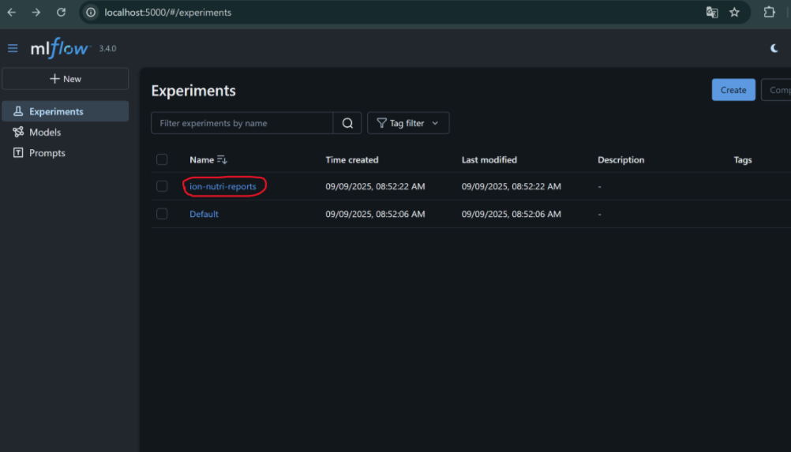

**Step 2:**

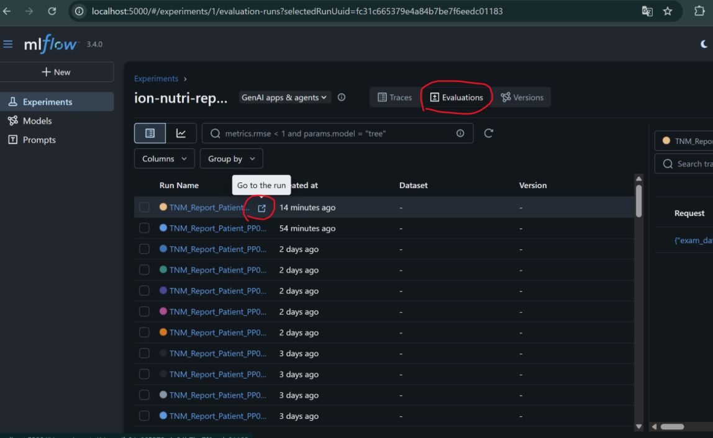

**Step 3:**

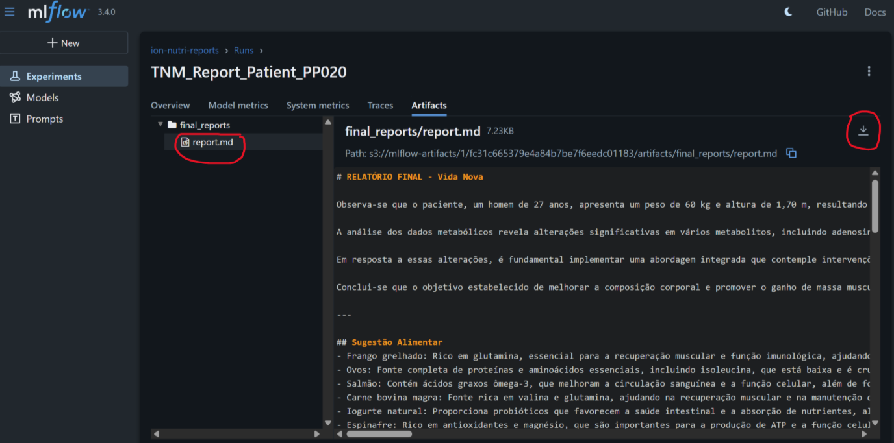

**VS Code Tip:** To better visualize generated reports, install the [Markdown Preview Github Styling](vscode:extension/bierner.markdown-preview-github-styles) extension that improves markdown file formatting.

**How to use**:

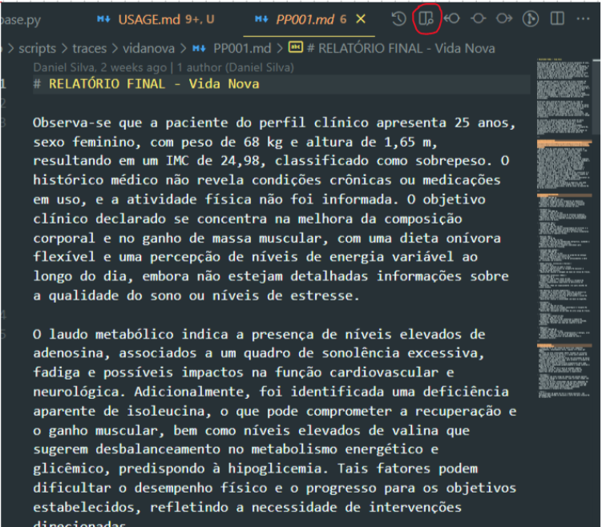

### Neo4j (Knowledge Graph)
- **URL**: http://localhost:7474
- **Login**: neo4j / password
- **Function**: Explore knowledge base
