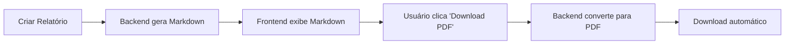
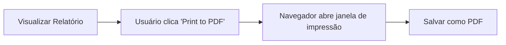

# Geração de PDF - Relatórios TNM

Este documento explica como gerar PDFs dos relatórios TNM e as diferenças entre os métodos disponíveis.

## 📋 Índice

- [Visão Geral](#visão-geral)
- [Método Atual (Frontend)](#método-atual-frontend)
- [Comparação de Métodos](#comparação-de-métodos)
- [Como Gerar PDF](#como-gerar-pdf)
- [Resolução de Problemas](#resolução-de-problemas)
- [Melhorias Futuras](#melhorias-futuras)

---

## 🔍 Visão Geral

O sistema ION NUTRI gera relatórios em formato **Markdown**, que podem ser convertidos para PDF de **duas formas**:

1. **Backend (Profissional)** - Usando `wkhtmltopdf` via API ✨ **NOVO**
2. **Frontend (Navegador)** - Usando `window.print()` com estilos otimizados

### Fluxo Atual

**Método 1: Download PDF via Backend (Recomendado)**


**Método 2: Print to PDF (Alternativo)**


---

## 🚀 Método 1: Download PDF via Backend (Recomendado)

### Como Funciona

1. Backend gera relatório em **Markdown**
2. Frontend exibe usando `ReactMarkdown`
3. Botão "⬇️ Download PDF" envia markdown para endpoint do backend
4. Backend converte Markdown → HTML → PDF usando `wkhtmltopdf`
5. PDF é baixado automaticamente no navegador

### Vantagens

✅ **Qualidade profissional** - PDF otimizado com wkhtmltopdf
✅ **Consistente** - Mesmo resultado em todos os navegadores
✅ **Fontes embutidas** - Roboto e outras fontes incluídas
✅ **Formatação perfeita** - HTML/CSS personalizado
✅ **Rápido** - Geração em 1-2 segundos

### Requisitos

⚠️ **wkhtmltopdf deve estar instalado no servidor**

- **Docker:** ✅ Já incluído no `Dockerfile` (nada a fazer!)
- **Local:** Ver [Guia de Instalação](./WKHTMLTOPDF_INSTALLATION.md) para instruções

### Endpoint da API

```
POST /api/v1/reports/pdf
Content-Type: application/json

{
  "markdown_content": "# Relatório TNM\n\n...",
  "patient_id": "ASH042514",
  "report_id": "TNM-2024-001"
}

Response:
Content-Type: application/pdf
Content-Disposition: attachment; filename="report_TNM-2024-001.pdf"
```

---

## 🌐 Método 2: Print to PDF via Navegador (Alternativo)

### Como Funciona

1. Backend gera relatório em **Markdown**
2. Frontend exibe usando `ReactMarkdown`
3. Botão "🖨️ Print to PDF" chama `window.print()`
4. Navegador aplica estilos `@media print` do CSS
5. Usuário salva como PDF na janela de impressão

### Estilos de Impressão

Os estilos de impressão foram otimizados em `frontend/src/styles/global.css`:

```css
@media print {
  /* Oculta elementos de UI */
  button, nav, .no-print {
    display: none !important;
  }

  /* Configura página A4 */
  @page {
    margin: 2cm;
    size: A4;
  }

  /* Otimiza tipografia */
  body {
    font-size: 12pt;
    line-height: 1.5;
  }

  /* Evita quebras de página ruins */
  h1, h2, h3 {
    page-break-after: avoid;
  }

  ul, ol, table {
    page-break-inside: avoid;
  }
}
```

### Vantagens

✅ Rápido e instantâneo
✅ Não requer backend
✅ Funciona offline
✅ Estilos otimizados para impressão

### Limitações

❌ Não gera outline/bookmarks
❌ Depende do navegador do usuário
❌ Fontes limitadas do sistema
❌ Menor controle sobre formatação

---

## 📊 Comparação de Métodos

| Aspecto | Backend (wkhtmltopdf) | Frontend (window.print) |
|---------|----------------------|------------------------|
| **Status** | ✅ **Implementado** | ✅ Implementado |
| **Recomendado** | ✅ **Sim** | ⚠️ Fallback |
| **Velocidade** | ⚡ 1-2 segundos | ⚡ Instantâneo |
| **Qualidade** | 🟢 **Excelente** | 🟡 Boa |
| **Consistência** | ✅ **Sempre igual** | ⚠️ Varia por navegador |
| **Fontes** | ✅ **Customizadas** | ⚠️ Sistema |
| **Requisitos** | ⚠️ wkhtmltopdf | ✅ Nenhum |
| **Offline** | ❌ Não | ✅ Sim |
| **Uso** | Download automático | Janela de impressão |

---

## 📖 Como Gerar PDF

### Método Recomendado: Download via Backend

1. **Gerar Relatório:**
   - Preencha o formulário em "Create Report"
   - Clique em "Generate Report"
   - Aguarde processamento (2-3 minutos)

2. **Visualizar Relatório:**
   - Você será redirecionado para a página de visualização
   - Revise o conteúdo do relatório

3. **Baixar PDF:**
   - Clique no botão "⬇️ Download PDF"
   - Aguarde 1-2 segundos
   - PDF será baixado automaticamente
   - Arquivo: `report_{report_id}.pdf`

**Se wkhtmltopdf não estiver instalado:**
- Você verá uma mensagem de erro
- Use o método alternativo "Print to PDF" abaixo

### Método Alternativo: Print to PDF via Navegador

1. **Após visualizar o relatório:**
   - Clique no botão "🖨️ Print to PDF"
   - Janela de impressão será aberta

2. **Configure opções de impressão:**
   - **Destino:** "Salvar como PDF"
   - **Layout:** Retrato
   - **Margens:** Padrão
   - **Escala:** 100%

3. **Salvar:**
   - Clique em "Salvar"
   - Escolha local e nome do arquivo

### Configurações Recomendadas de Impressão

Para melhor resultado ao salvar como PDF:

**Google Chrome / Edge:**
```
Destino: Salvar como PDF
Layout: Retrato
Páginas: Todas
Cor: Colorido
Margens: Padrão
Escala: 100%
Opções: ☐ Cabeçalhos e rodapés
         ☐ Gráficos de fundo
```

**Firefox:**
```
Destino: Salvar como PDF
Orientação: Retrato
Páginas: Todas
Margens: Padrão (2cm)
Escala: 100%
```

---

## 🐛 Resolução de Problemas

### Problema: PDF com muitas páginas

**Causa:** Conteúdo com quebras de página ruins
**Solução:**
1. Use Chrome/Edge (melhor suporte a `break-inside: avoid`)
2. Ajuste zoom para 100%
3. Verifique margens (2cm recomendado)

### Problema: Botões aparecem no PDF

**Causa:** Classe `.no-print` não aplicada
**Solução:**
1. Verifique se CSS está carregado
2. Force refresh: `Ctrl+Shift+R` (Windows) ou `Cmd+Shift+R` (Mac)
3. Limpe cache do navegador

### Problema: Fontes diferentes do esperado

**Causa:** Navegador usa fontes do sistema
**Solução:**
- Instale as fontes Roboto e Barlow no sistema
- Ou aguarde implementação do endpoint de PDF no backend

### Problema: Links quebram layout

**Causa:** URLs longas após links
**Solução:**
1. Edite `global.css` e comente:
   ```css
   /* .prose a[href]:after {
     content: " (" attr(href) ")";
   } */
   ```

---

## 🚀 Melhorias Futuras

### Planejado

- [ ] **Persistência de Relatórios:** Salvar relatórios em banco de dados
- [ ] **Endpoint GET `/reports/{id}/pdf`:** Buscar relatório salvo e gerar PDF
- [ ] **Outline/Bookmarks:** Adicionar navegação no PDF (requer versão específica do wkhtmltopdf)
- [ ] **Preview de PDF:** Visualizar PDF antes de baixar
- [ ] **Opções de formatação:** Escolher tamanho (A4/Letter), margens, orientação
- [ ] **Watermark opcional:** Adicionar marca d'água personalizada
- [ ] **Assinatura digital:** Assinar PDFs digitalmente
- [ ] **Envio por email:** Enviar relatório em PDF por email
- [ ] **Compressão de PDF:** Reduzir tamanho do arquivo
- [ ] **Multi-idioma:** Suporte para gerar PDFs em diferentes idiomas

---

## 📚 Referências Técnicas

- [MDN: window.print()](https://developer.mozilla.org/en-US/docs/Web/API/Window/print)
- [CSS @media print](https://developer.mozilla.org/en-US/docs/Web/CSS/@media/print)
- [CSS Paged Media](https://www.w3.org/TR/css-page-3/)
- [wkhtmltopdf](https://wkhtmltopdf.org/)

---

## 📝 Changelog

### 2025-12-16 - v2.0 (Backend PDF Implementation)

**Backend:**
- ✅ Adicionado serviço `PDFService` com suporte a wkhtmltopdf
- ✅ Criado endpoint `POST /api/v1/reports/pdf` para gerar PDFs
- ✅ Implementada conversão Markdown → HTML → PDF
- ✅ Estilos HTML personalizados para PDFs profissionais
- ✅ Adicionadas dependências: `pdfkit`, `markdown2`

**Frontend:**
- ✅ Adicionado botão "⬇️ Download PDF" (método principal)
- ✅ Renomeado botão para "🖨️ Print to PDF" (método alternativo)
- ✅ Implementada função `reportsApi.generatePDF()`
- ✅ Tratamento de erros quando wkhtmltopdf não está instalado
- ✅ Download automático de PDF gerado

**Documentação:**
- ✅ Criado `docs/WKHTMLTOPDF_INSTALLATION.md`
- ✅ Atualizado `docs/PDF_GENERATION.md` com novos métodos
- ✅ Documentação de API do endpoint
- ✅ Guia de instalação para Ubuntu, Debian, macOS e Docker

**Estilos:**
- ✅ Estilos `@media print` otimizados (v1.0)
- ✅ Classe `.no-print` para ocultar UI
- ✅ Estilos HTML customizados para wkhtmltopdf

### Próximas Versões
- ⏳ v3.0: Persistência de relatórios em banco de dados
- ⏳ v3.1: Endpoint GET `/reports/{id}/pdf`
- ⏳ v4.0: Outline/bookmarks automáticos no PDF
