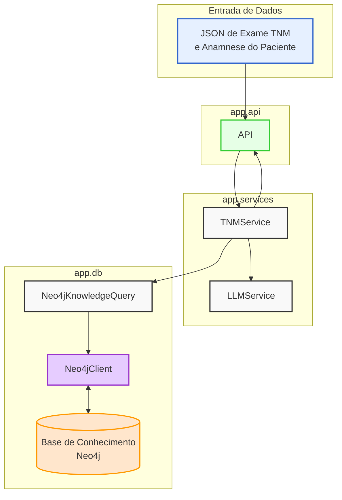
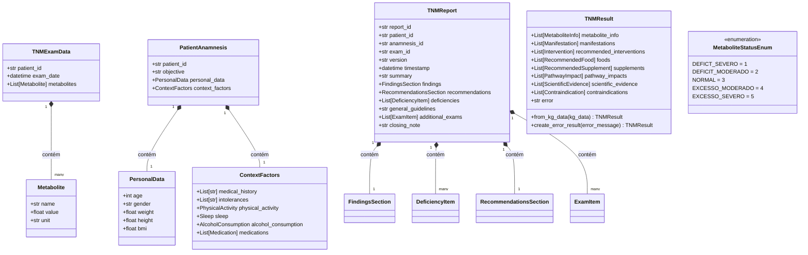
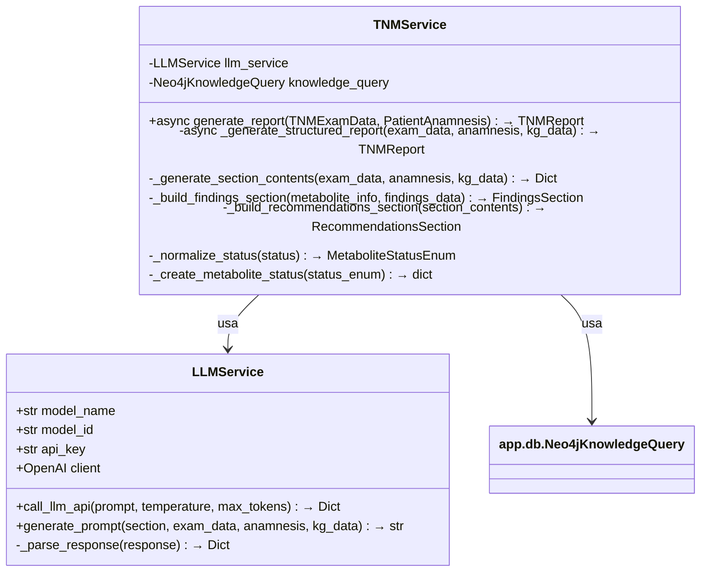
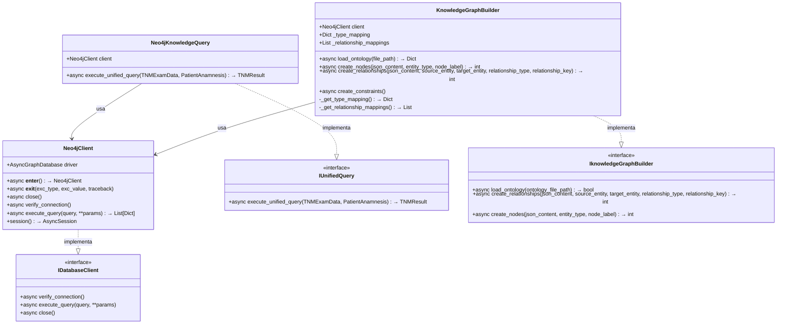
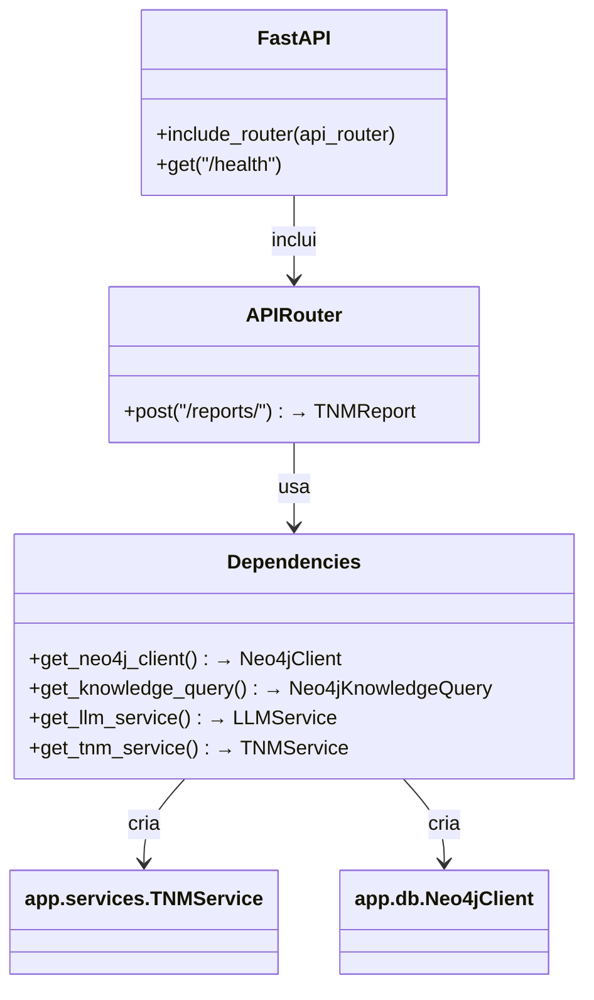
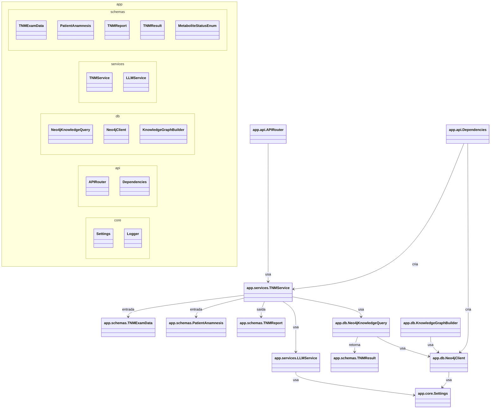

# Arquitetura do Sistema

## 1. Visão Geral

> "Um sistema especializado que transforma dados nutrimetabólicos normalizados em relatórios personalizados utilizando conhecimento estruturado e modelos de linguagem."

O sistema foi projetado com foco na simplicidade e eficiência, eliminando componentes desnecessários e trabalhando diretamente com dados já normalizados.



## 2. Componentes do Sistema

### 2.1 Diagramas de Classes por Módulo

#### a) app.schemas



#### b) app.services



#### c) app.db



#### d) app.api



### 2.2 Diagrama de Classes de Alto Nível (com Namespaces e Relações)



### 2.3 Estrutura de Diretórios

O sistema segue as melhores práticas para FastAPI, com os modelos em `schemas` e serviços em `services`, organizados em namespaces/pacotes:

```
ion-nutri/
│
├── app/                     # Código fonte da aplicação
│   ├── api/                 # Endpoints da API (namespace: app.api)
│   │   ├── __init__.py
│   │   ├── router.py        # Configuração de rotas
│   │   ├── dependencies.py  # Injeção de dependências
│   │   └── endpoints/       # Implementação dos endpoints
│   │       ├── __init__.py
│   │       └── reports.py   # Endpoint principal de relatórios TNM
│   │
│   ├── core/                # Núcleo da aplicação (namespace: app.core)
│   │   ├── __init__.py
│   │   ├── config.py        # Configurações (variáveis de ambiente)
│   │   └── logging.py       # Configuração de logs
│   │
│   ├── db/                  # Acesso ao banco de dados e queries (namespace: app.db)
│   │   ├── __init__.py
│   │   ├── base.py          # Interfaces abstratas
│   │   ├── neo4j_client.py  # Cliente Neo4j
│   │   ├── knowledge_graph_builder.py # Builder do grafo
│   │   └── unified_query.py # Query unificada do grafo
│   │
│   ├── schemas/             # Modelos de dados (Pydantic) (namespace: app.schemas)
│   │   ├── __init__.py
│   │   ├── exam.py          # Modelo do exame TNM
│   │   ├── patient_anamnesis.py # Modelo da anamnese
│   │   ├── report.py        # Modelo do relatório TNM
│   │   ├── status.py        # Enum de status
│   │   └── tnm_result.py    # Modelo do resultado do grafo
│   │
│   ├── services/            # Serviços de negócio (namespace: app.services)
│   │   ├── __init__.py
│   │   ├── tnm_service.py   # Serviço principal TNM
│   │   └── llm_service.py   # Cliente da LLM
│   │
│   ├── utils/               # Utilitários (namespace: app.utils)
│   │   └── utils.py
│   │
│   └── main.py              # Ponto de entrada da aplicação
│
├── tests/                   # Testes automatizados
│   ├── __init__.py
│   ├── conftest.py
│   ├── api/
│   └── services/
│
├── docs/                    # Documentação
│   ├── arquitetura.md
│   ├── development.md
│   └── templates/
│       └── tnm.md
│
├── Dockerfile
├── docker-compose.yml
├── README.md
└── ...
```

## 3. Práticas e Princípios de Desenvolvimento

Para informações detalhadas sobre as práticas e princípios de desenvolvimento utilizados neste projeto, consulte o arquivo [development.md](development.md).

## 4. CHANGELOG

### Consolidação e Materialização da Arquitetura (2025-07-01)

1. **Evolução do Modelo de Dados**:
    - Introdução do `TNMResult` como ponte entre knowledge graph e relatórios
    - Formalização do sistema de classificação de metabólitos com `MetaboliteStatusEnum`
    - Padronização de interfaces para diferentes tipos de dados estruturados (manifestações, intervenções, evidências)

2. **Maturação da Camada de Serviços**:
    - Consolidação do `TNMService` como orquestrador central do fluxo de geração de relatórios
    - Estabelecimento de padrões para integração com LLMs através do `LLMService`
    - Implementação de sistema de seções modulares para relatórios TNM

3. **Aprimoramento da Arquitetura de Dados**:
    - Introdução de sistema de logging estruturado em Markdown para auditoria
    - Padronização de serialização de dados temporais (timestamps, datas)
    - Estabelecimento de configurações centralizadas para classificação de status

4. **Refinamento da Documentação Arquitural**:
    - Reorganização dos diagramas para refletir namespaces reais da implementação
    - Documentação de interfaces abstratas para garantir extensibilidade
    - Detalhamento das relações entre componentes conforme implementação atual

5. **Impactos na Arquitetura**:
    - **Melhoria na Coesão**: Centralização da lógica de geração de relatórios no `TNMService`
    - **Aumento da Flexibilidade**: Sistema modular de seções permite extensões futuras
    - **Padronização de Dados**: Modelos estruturados facilitam integração e manutenção
    - **Auditabilidade**: Sistema de logging permite rastreamento de decisões e resultados

### Mudanças na Arquitetura (2025-05-21)

1. **Consolidação de Serviços**:
    - Unificação do `Neo4jDatabase`, `OntologyBuilder` e `Neo4jKnowledgeGraph` em um único `Neo4jClient`
    - Movimentação da geração de prompts e formatação de relatórios para dentro do `TNMService`
    - Simplificação da interface com LLM para um único serviço `LLMService`

2. **Redução de Camadas de Abstração**:
    - Remoção de interfaces que possuíam apenas uma implementação
    - Simplificação da hierarquia de classes
    - Criação de um fluxo mais direto entre componentes

3. **Simplificação da Estrutura de Diretórios**:
    - Redução do número de arquivos de serviços
    - Organização mais direta do projeto

4. **Motivações para as Mudanças**:
    - Redução da complexidade acidental do sistema
    - Aceleração do desenvolvimento inicial
    - Melhoria da manutenibilidade e compreensão do código
    - Facilitação do onboarding de novos desenvolvedores

5. **Princípios Preservados**:
    - Todos os princípios de Clean Architecture foram mantidos
    - A aderência aos princípios SOLID foi preservada
    - A testabilidade do sistema não foi comprometida
