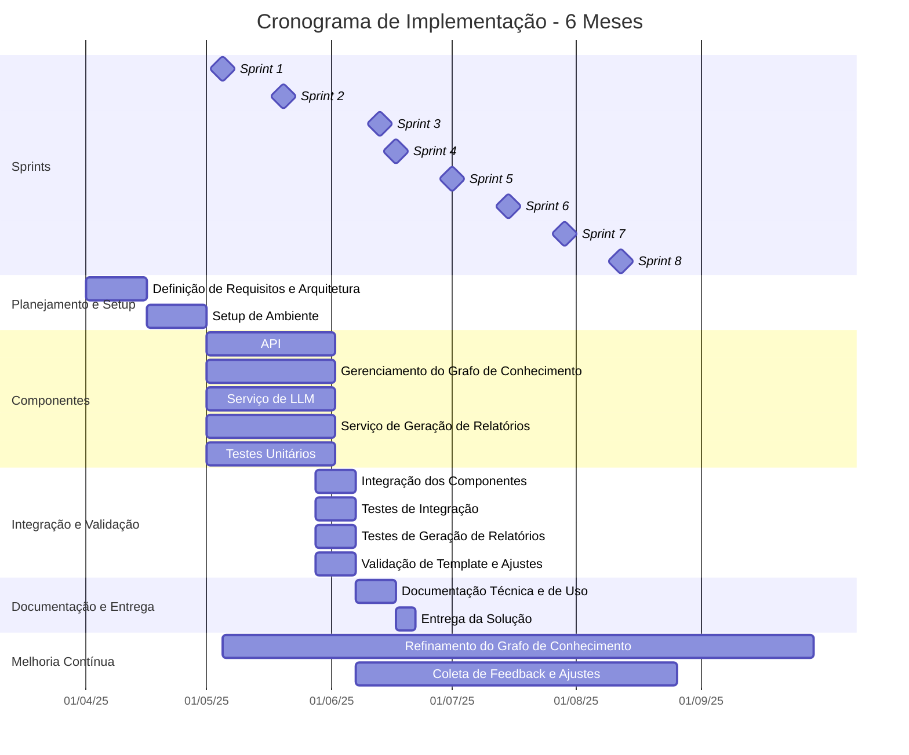
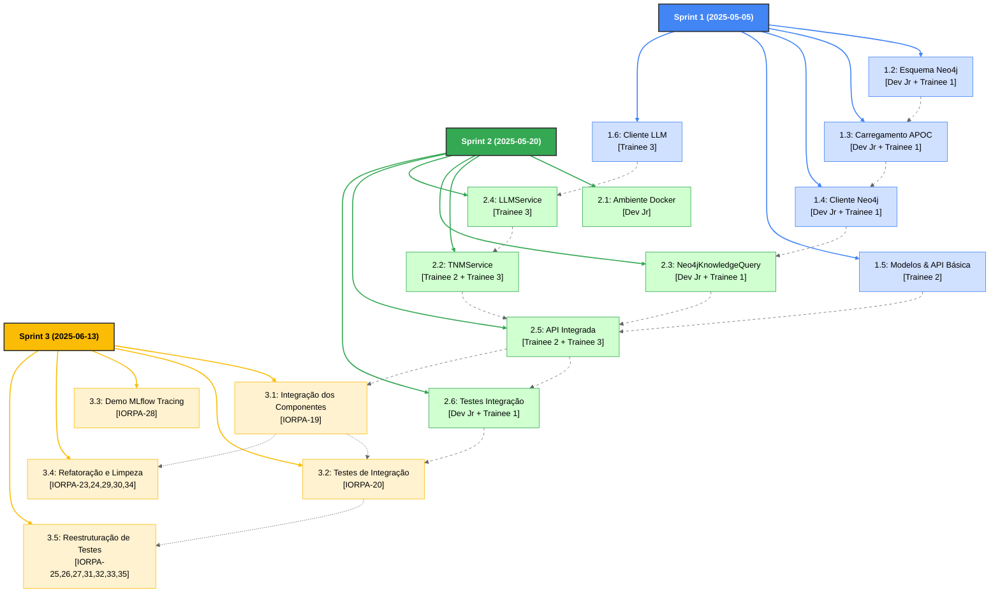

# Cronograma e Métricas

## Cronograma do Projeto

## Descrição das Etapas

- **Planejamento e Setup**: Definição de requisitos, arquitetura e setup do ambiente de desenvolvimento.
- **Desenvolvimento dos Componentes**: Implementação paralela dos principais componentes do sistema (API, integração Neo4j, prompts, LLM, montagem do relatório) com testes unitários ocorrendo simultaneamente durante o desenvolvimento.
- **Sprints**: O projeto segue uma metodologia ágil com sprints de 21 dias, permitindo entregas incrementais e validação contínua.
- **Integração e Validação**: Integração dos componentes, testes de integração, geração de relatórios e validação de aderência ao template oficial.
- **Documentação e Entrega**: Documentação técnica, de uso e entrega da solução.
- **Melhoria Contínua**: Coleta de feedback dos especialistas, ajustes incrementais, atualização de regras/modelos e refinamento contínuo do grafo de conhecimento Neo4j ao longo de todo o projeto, desde a Sprint 1 até a Sprint 8.

## Métricas de Sucesso

1. **Redução de Tempo Operacional**
   - Meta: ≤5 min por relatório TNM (de 40 min)
   - Medição: Tempo entre entrada dos dados e geração do relatório final

2. **Aderência ao Template Oficial**
   - Meta: 100% dos relatórios seguem a estrutura do template TNM
   - Medição: Validação automatizada de formato e seções

3. **Taxa de Aprovação Direta**
   - Meta: ≥70% dos relatórios aprovados sem ajustes manuais
   - Medição: Proporção de relatórios sem comentários/correções

4. **Qualidade das Recomendações**
   - Meta: ≥90% de aderência às diretrizes nutricionais
   - Medição: Avaliação amostral por especialistas

5. **Tempo de Revisão por Especialista**
   - Meta: Redução ≥80% vs. processo manual
   - Medição: Tempo médio de revisão por relatório

6. **Rastreabilidade e Logging**
   - Meta: 100% dos relatórios com histórico de decisões e revisões
   - Medição: Auditoria de logs e versionamento

7. **Feedback Incorporado**
   - Meta: ≥90% dos feedbacks críticos incorporados em até 2 ciclos
   - Medição: Tempo entre feedback e ajuste no sistema

## Observações

- O cliente relatou apenas a primeira métrica.
- O cronograma e as métricas devem ser revisados periodicamente conforme o sistema evolui.
- A automação não elimina a necessidade de supervisão clínica, mas potencializa a produtividade e a padronização.
- Todo o fluxo segue a arquitetura simplificada descrita em docs/arquitetura.md e o template oficial do relatório TNM.

## Diagrama Hierárquico de Sprints, Entregáveis e Atribuições

## Descrições Detalhadas dos Entregáveis

As issues das sprints 2 e 3 vão ser atualizadas de acordo com o progresso da sprint 1 (e.g. novos desafios, necessidades, e aprendizados).

### Sprint 1 (2025-05-05)

#### 1.1: Esquema Neo4j [Dev Jr + Trainee 1]
- **Descrição**: Definição da estrutura do grafo Neo4j usando Cypher
- **Atividades**:
  - Criar constraints para garantir unicidade de nós
  - Definir estrutura de nós para todos os tipos de entidades (Metabolite, Pathway, etc.)
  - Definir relacionamentos entre entidades
  - Documentar o esquema
- **Critérios de Aceite**:
  - Schema criado seguindo ontologia nutri-metabólica
  - Constraints de unicidade definidos
  - Queries de exemplo funcionando corretamente

#### 1.2: Carregamento APOC [Dev Jr + Trainee 1]
- **Descrição**: Implementação de carregamento de dados usando APOC
- **Atividades**:
  - Desenvolver queries Cypher com APOC para processamento de JSON
  - Implementar método load_ontology() que utiliza APOC
  - Tratar erros e exceções
  - Fornecer feedback sobre o carregamento (estatísticas)
- **Critérios de Aceite**:
  - Carregamento bem-sucedido de arquivo JSON de amostra
  - Tratamento adequado de erros
  - Performance superior ao método tradicional

#### 1.3: Cliente Neo4j [Dev Jr + Trainee 1]
- **Descrição**: Interface para comunicação com o banco Neo4j
- **Atividades**:
  - Implementar interface DatabaseClient abstrata
  - Implementar classe concreta Neo4jClient
  - Adicionar métodos para conexão, execução de queries e fechamento
  - Implementar tratamento de erros e autenticação
- **Critérios de Aceite**:
  - Cliente se conecta corretamente ao Neo4j
  - Executa queries e retorna resultados em formato adequado
  - Tratamento adequado de erros de conexão e timeout

#### 1.4: Modelos & API Básica [Trainee 2]
- **Descrição**: Implementação dos modelos de dados e API básica em uma única tarefa
- **Atividades**:
  - Implementar modelos Pydantic para TNMExamData, Metabolite, PatientAnamnesis
  - Adicionar validações de dados para todos os modelos
  - Configurar servidor FastAPI e sistema de roteadores
  - Implementar rota básica POST /reports
  - Criar testes para modelos e endpoints
- **Critérios de Aceite**:
  - Modelos validam corretamente entradas
  - API aceita requisições POST com dados de exame e anamnese
  - Testes unitários para modelos e endpoints passam

#### 1.5: Cliente LLM [Trainee 3]
- **Descrição**: Interface para comunicação com modelos de linguagem
- **Atividades**:
  - Implementar interface LLMClientService
  - Implementar classes concretas (OpenAIClient, ClaudeClient)
  - Adicionar tratamento de erros, retentativas e timeout
  - Configurar parâmetros ideais (temperatura, tokens)
- **Critérios de Aceite**:
  - Cliente se conecta e chama API do LLM escolhido
  - Tratamento adequado de erros e limites de rate
  - Configurável via variáveis de ambiente

### Sprint 2 (2025-05-26)

#### 2.1: Ambiente Docker [Dev Jr]
- **Descrição**: Configuração do ambiente de desenvolvimento usando Docker e Docker Compose
- **Atividades**:
  - Criar Dockerfile para Neo4j com extensões APOC habilitadas
  - Configurar docker-compose.yml para todos os serviços (Neo4j, API)
  - Garantir persistência de dados e compartilhamento de volumes
  - Configurar variáveis de ambiente e networking
- **Critérios de Aceite**:
  - Ambiente completo inicializa com um único comando
  - APOC está acessível no Neo4j
  - Volumes mapeados corretamente para persistência

#### 2.2: TNMService [Trainee 2 + Trainee 3]
- **Descrição**: Serviço central consolidado que inclui geração de prompts, formatação de relatórios e orquestração do fluxo completo
- **Atividades**:
  - Implementar TNMService com geração de prompts e formatação integradas
  - Preparar stubs para futura integração com Neo4jClient e LLMService
  - Implementar métodos internos para formatação de dados e geração de prompts
  - Adicionar logging detalhado e tratamento centralizado de erros
- **Critérios de Aceite**:
  - Desenho completo do fluxo de geração end-to-end
  - Prompts gerados incluem todos os dados relevantes
  - Relatórios formatados seguem a estrutura esperada
  - Logs detalhados de cada etapa do processo
  - Tratamento adequado de cenários de erro

#### 2.3: Neo4jKnowledgeQuery [Dev Jr + Trainee 1]
- **Descrição**: Camada intermediária especializada para consultas de conhecimento que traduz entre dados estruturados de domínio e queries Cypher complexas
- **Atividades**:
  - Implementar classe Neo4jKnowledgeQuery que recebe TNMExamData e PatientAnamnesis
  - Desenvolver consulta unificada Cypher que extrai todos os dados relevantes do grafo de conhecimento
  - Implementar método execute_unified_query() que encapsula toda a lógica de consulta
  - Traduzir objetos de domínio para parâmetros de query e vice-versa
  - Otimizar consulta para performance e retornar dados estruturados
  - Adicionar tratamento de erros específicos para consultas de conhecimento
- **Critérios de Aceite**:
  - Consulta unificada retorna todos os dados necessários em uma única operação
  - Interface recebe objetos de domínio e retorna dados estruturados
  - Performance adequada (< 2 segundos para consultas típicas)
  - TNMService não precisa conhecer detalhes de Cypher
  - Separação clara entre responsabilidades de domínio e dados
  - Formato de saída compatível com geração de prompts

#### 2.4: LLMService [Trainee 3]
- **Descrição**: Serviço simplificado para comunicação com modelos de linguagem
- **Atividades**:
  - Implementar LLMService seguindo a arquitetura simplificada
  - Adicionar tratamento de erros, retentativas e timeout
  - Configurar parâmetros ideais (temperatura, tokens)
  - Integrar com TNMService
- **Critérios de Aceite**:
  - Serviço se conecta e chama API do LLM escolhido
  - Tratamento adequado de erros e limites de rate
  - Configurável via variáveis de ambiente
  - Interface simplificada e funcional

#### 2.5: API Integrada [Trainee 2 + Trainee 3]
- **Descrição**: Endpoints completos da API integrados com todos os componentes do sistema
- **Atividades**:
  - Finalizar implementação do endpoint principal
  - Integrar todos os componentes desenvolvidos (TNMService, Neo4jClient, LLMService)
  - Adicionar sistema de injeção de dependências
  - Configurar middleware, CORS, rate limiting
  - Implementar logging e monitoramento
- **Critérios de Aceite**:
  - Endpoint completo com todas as funcionalidades
  - Integração funcional de todos os componentes
  - Sistema de dependências funciona corretamente
  - API documentada com Swagger/OpenAPI

#### 2.6: Testes Integração [Dev Jr + Trainee 1]
- **Descrição**: Testes automatizados end-to-end para todo o sistema
- **Atividades**:
  - Configurar ambiente de testes com dados de exemplo
  - Implementar testes de integração para o fluxo completo
  - Adicionar mocks para componentes externos (LLM)
  - Configurar testes de performance básicos
  - Validar a arquitetura simplificada em ambiente integrado
- **Critérios de Aceite**:
  - Cobertura de testes de integração > 80%
  - Testes verificam fluxo completo de dados
  - Testes executam em ambiente CI/CD
  - Validação adequada da nova arquitetura simplificada

### Sprint 3 (2025-06-13 - 2025-07-01)

#### 3.1: Integração dos Componentes [IORPA-19]
- **Descrição**: Integração completa de todos os componentes do sistema IonNutri
- **Atividades**:
  - Integrar TNMService, Neo4jKnowledgeQuery e LLMService
  - Configurar fluxo end-to-end de geração de relatórios
  - Validar comunicação entre componentes
- **Critérios de Aceite**:
  - Sistema completo funcionando end-to-end
  - Todos os componentes comunicando corretamente

#### 3.2: Testes de Integração [IORPA-20]
- **Descrição**: Implementação de testes de integração completos para o sistema
- **Atividades**:
  - Criar suíte de testes de integração
  - Validar fluxo completo de dados
  - Configurar ambiente de testes
- **Critérios de Aceite**:
  - Cobertura de testes de integração adequada
  - Testes validam fluxo completo de geração de relatórios

#### 3.3: Demo MLflow Tracing [IORPA-28]
- **Descrição**: Criação de demonstração do uso do MLflow Tracing para rastreamento de LLM
- **Atividades**:
  - Implementar demo com MLflow Tracing
  - Configurar rastreamento de chamadas LLM
  - Documentar uso e benefícios
- **Critérios de Aceite**:
  - Demo funcional do MLflow Tracing
  - Documentação clara do processo

#### 3.4: Refatoração e Limpeza [IORPA-23,24,29,30,34]
- **Descrição**: Refatoração de código e remoção de componentes obsoletos
- **Atividades**:
  - Mover testes de db para services
  - Remover arquivos desnecessários (test_reports.py, pastas obsoletas)
  - Refatorar métodos do TNMService
  - Otimizar uso de kg_data
- **Critérios de Aceite**:
  - Código limpo e organizado
  - Remoção de componentes obsoletos
  - Melhoria na estrutura do projeto

#### 3.5: Reestruturação de Testes [IORPA-25,26,27,31,32,33,35]
- **Descrição**: Correção, reestruturação e expansão da cobertura de testes
- **Atividades**:
  - Corrigir testes quebrados
  - Reavaliar e remover testes supérfluos
  - Adicionar testes unitários para API, TNMService e LLMService
  - Separar estrutura de testes (unit, integração)
- **Critérios de Aceite**:
  - Todos os testes passando
  - Cobertura de testes completa para componentes principais
  - Estrutura de testes bem organizada

## Backlog Futuro

#### Validação Structured Responses LLM
- **Descrição**: Implementação de validação estruturada das respostas do LLM
- **Atividades**:
  - Modificar comunicação com LLM para solicitar JSON estruturado
  - Implementar validação com JSON Schema
  - Adicionar tratamento para respostas mal formadas
  - Implementar fallback para casos de falha
- **Estimativa**: 5 dias

#### API Expandida (get_report)
- **Descrição**: Endpoints adicionais para consulta de relatórios gerados
- **Atividades**:
  - Implementar armazenamento persistente de relatórios
  - Adicionar endpoint GET /reports/{report_id}
  - Implementar filtragem e paginação
  - Adicionar controle de acesso
- **Estimativa**: 4 dias

#### LLM para Queries Neo4j
- **Descrição**: Usar LLM para gerar ou refinar consultas ao grafo
- **Atividades**:
  - Implementar LLMQueryProcessor
  - Criar prompts especializados para geração de queries
  - Adicionar validação de segurança para queries geradas
  - Integrar com o fluxo existente
- **Estimativa**: 7 dias

#### Mecanismo de Feedback Básico
- **Descrição**: Sistema simples para capturar feedback de especialistas
- **Atividades**:
  - Implementar modelo de dados para feedback
  - Adicionar endpoint POST /reports/{report_id}/feedback
  - Criar estrutura de armazenamento para feedbacks
  - Implementar relatórios básicos de feedback
- **Estimativa**: 5 dias

#### Controle de Versão de Relatórios
- **Descrição**: Sistema para versionamento e rastreamento de mudanças
- **Atividades**:
  - Implementar estrutura de dados para versões
  - Adicionar controle de revisões em relatórios
  - Criar interface para visualizar histórico
  - Implementar comparação entre versões
- **Estimativa**: 8 dias

#### Validação com Especialistas
- **Descrição**: Processo formal de validação por especialistas em nutrição
- **Atividades**:
  - Criar fluxo de revisão por especialistas
  - Implementar sistema de distribuição de tarefas
  - Adicionar métricas de qualidade por especialista
  - Integrar feedback ao processo de melhoria
- **Estimativa**: 10 dias

## CHANGELOG

### Atualização Sprint 3 (2025-07-01)

1. **Conclusão da Sprint 3**:
   - Duração: 2025-06-13 a 2025-07-01 (3 semanas)
   - 15 issues concluídas com foco em integração, testes e refatoração
   - Consolidação do sistema com todos os componentes funcionando end-to-end

2. **Entregáveis Realizados**:
   - **Integração Completa**: Todos os componentes do sistema integrados e funcionando
   - **Cobertura de Testes**: Implementação de testes de integração e expansão da cobertura unitária
   - **Demo MLflow**: Demonstração de rastreamento de LLM para auditoria e debugging
   - **Refatoração**: Limpeza de código e remoção de componentes obsoletos
   - **Reestruturação de Testes**: Organização e correção da suíte de testes

3. **Impactos**:
   - Sistema pronto para uso em ambiente de produção
   - Base sólida de testes para manutenção futura
   - Código limpo e bem estruturado
   - Documentação técnica atualizada

### Mudanças no Cronograma (2025-05-23)

1. **Consolidação de Entregáveis (Sprint 2)**:
   - Consolidação das tarefas 2.1 (Gerador de Prompts), 2.2 (Processador Markdown) e antiga 2.5 (TNMService) em um único entregável 2.1: "TNMService Integrado"
   - Transformação da tarefa 2.2 em "Neo4jKnowledgeQuery", implementando camada intermediária especializada para consultas de conhecimento
   - Remoção da tarefa 2.3 (Neo4jClient Unificado) mantendo a separação de responsabilidades existente
   - Renumeração da tarefa 2.5 para 2.3: "LLMService" como evolução da tarefa 1.7 não completada na Sprint 1

2. **Alinhamento com Arquitetura de Separação de Responsabilidades**:
   - Neo4jKnowledgeQuery como camada intermediária entre TNMService (domínio) e Neo4jClient (dados)
   - Manutenção da separação entre operações básicas de banco e consultas especializadas de conhecimento
   - Encapsulamento de queries Cypher complexas na camada de dados apropriada

3. **Redistribuição de Responsabilidades**:
   - Trainee 2 e Trainee 3 trabalharão no TNMService Integrado
   - Dev Jr e Trainee 1 responsáveis pela Neo4jKnowledgeQuery (camada de consultas especializadas)
   - Trainee 3 responsável pelo LLMService

4. **Motivações para as Mudanças**:
   - Manutenção dos princípios SOLID e separação de responsabilidades
   - Criação de camada intermediária que traduz entre domínio e dados
   - Encapsulamento de complexidade de Cypher longe dos serviços de domínio
   - Facilitação de testes e manutenção do código

### Mudanças no Cronograma (2025-05-26)

1. **Reorganização de Sprints e Tarefas**:
   - Movimentação da tarefa 1.1 (Ambiente Docker) da Sprint 1 para Sprint 2, com reatribuição do Dev Senior/Tech Lead para Dev Jr
   - Movimentação das tarefas 3.1 (API Integrada) e 3.2 (Testes Integração) da Sprint 3 para Sprint 2
   - Reorganização dos IDs das tarefas da Sprint 1 para sequência contínua (1.1, 1.2, 1.3, 1.4, 1.5)

2. **Consolidação da Sprint 2**:
   - Sprint 2 agora concentra a maior parte do desenvolvimento com 6 entregáveis
   - Integração completa do sistema (API + Testes) movida para Sprint 2
   - Sprint 3 fica disponível para refinamentos e melhorias

3. **Motivações para as Mudanças**:
   - Aceleração do desenvolvimento com integração mais cedo no cronograma
   - Melhor distribuição de carga de trabalho entre as sprints
   - Ambiente Docker configurado junto com outros componentes de infraestrutura
