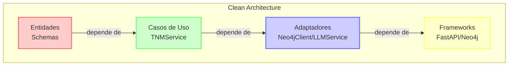
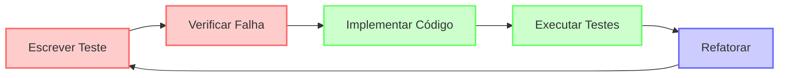
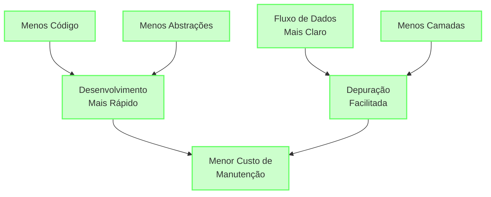

# Desenvolvimento

### Requisitos

- Python 3.12 ou superior
- [uv](https://astral.sh/uv) para gerenciamento de dependências e ambientes virtuais

### Setup do Ambiente

1. Clone o repositório:
```bash
git clone https://github.com/edgebr/ion-nutri.git
cd ion-nutri
```

2. Execute o script de setup:
```bash
./setup.sh
```

3. Ative o ambiente virtual:
```bash
source .venv/bin/activate
```

### Gerenciamento de Dependências com uv

O projeto utiliza o [uv](https://astral.sh/uv), uma ferramenta moderna e rápida para gerenciamento de dependências Python. Para mais detalhes sobre o uv, consulte a [documentação oficial](https://astral.sh/uv/docs).

#### Comandos Comuns do uv

```bash
# Instalar dependências do projeto
uv pip install -r requirements.txt

# Instalar uma nova dependência
uv pip install nome-do-pacote

# Atualizar todas as dependências
uv pip compile requirements.txt --upgrade

# Gerar requirements.txt com versões fixas
uv pip compile requirements.in -o requirements.txt
```

### Testes

Para executar os testes do projeto, incluindo a geração de relatório de cobertura:

```bash
# Executar todos os testes com cobertura
uv run python -m pytest --cov=app --cov-report=html tests/

# Executar testes específicos
uv run python -m pytest tests/caminho/para/teste.py

# Executar testes com detalhes verbosos
uv run python -m pytest -v tests/
```

O relatório de cobertura será gerado no diretório `htmlcov/`. Abra o arquivo `htmlcov/index.html` em seu navegador para visualizar o relatório detalhado.

### Ferramentas de Desenvolvimento

O projeto utiliza um conjunto abrangente de ferramentas para garantir a qualidade do código através de hooks de pre-commit configurados de forma integrada.

#### Pre-commit Hooks Configurados

O sistema de pre-commit inclui as seguintes ferramentas que são executadas automaticamente a cada commit:

##### Formatação de Código
- **Ruff**: Linting, formatação e organização de imports ultra-rápida para Python (substitui Black + isort + Flake8)

##### Verificação de Qualidade
- **MyPy**: Verificação de tipos estáticos
- **PyDocStyle**: Verificação de docstrings e documentação

##### Verificação de Segurança
- **Bandit**: Scanner de segurança para código Python
- **detect-secrets**: Detecção de segredos e credenciais no código
- **pip-audit**: Auditoria de vulnerabilidades em dependências

##### Verificação de Arquivos
- **Verificação YAML/JSON/TOML**: Validação de sintaxe de arquivos de configuração
- **Verificação de linha final**: Garantia de quebra de linha no final dos arquivos
- **Remoção de espaços em branco**: Limpeza automática de espaços desnecessários
- **Verificação de conflitos de caso**: Detecção de conflitos de nomenclatura de arquivos
- **Verificação de arquivos grandes**: Prevenção de commit de arquivos muito grandes

##### Padrões de Commit
- **Commitizen**: Padronização de mensagens de commit seguindo Conventional Commits

#### Configuração e Uso

Para configurar o pre-commit após instalar as dependências:

```bash
# Instalar os hooks de pre-commit
uv run pre-commit install

# Executar hooks manualmente em todos os arquivos
uv run pre-commit run --all-files

# Executar hooks apenas em arquivos específicos
uv run pre-commit run --files app/ tests/
```

#### Escopo dos Hooks

As ferramentas específicas do Python (Ruff, MyPy, PyDocStyle, Bandit, detect-secrets) são configuradas para executar apenas nos diretórios `app/` e `tests/`, otimizando o tempo de execução e focando na qualidade do código de produção.

#### Comportamento dos Hooks

- **Correções automáticas**: Ruff aplica correções de linting, formatação e organização de imports automaticamente
- **Falha intencional**: Hooks como MyPy, Bandit e PyDocStyle falharão o commit quando encontrarem problemas que requerem atenção manual
- **Relatórios detalhados**: Cada ferramenta fornece relatórios específicos para facilitar a correção de problemas
- **Performance otimizada**: Ruff (escrito em Rust) é 10-100x mais rápido que as alternativas em Python

#### Bypass de Hooks (Uso Emergencial)

Em situações excepcionais, é possível fazer commit sem executar os hooks:

```bash
git commit -m "mensagem" --no-verify
```

**Nota**: Esta prática deve ser evitada e os problemas de qualidade devem ser corrigidos em commits subsequentes.

# Práticas e Princípios de Desenvolvimento

### 3.1 Clean Architecture

A arquitetura do sistema mantém os princípios da Clean Architecture, organizando o código em camadas com responsabilidades bem definidas:



#### Princípios Implementados:

1. **Independência de Frameworks**: O core da aplicação não depende diretamente de frameworks externos.

2. **Testabilidade**: A lógica de negócio concentrada no TNMService permanece facilmente testável.

3. **Independência de UI**: A lógica de negócio não depende da interface (API REST).

4. **Independência de Banco de Dados**: O TNMService usa o Neo4jClient como uma abstração para o banco de dados.

5. **Independência de Agentes Externos**: O LLMService abstrai os detalhes do provedor de LLM específico.

#### Mapeamento para o Projeto:

- **Entities (Core)**: Representadas pelos modelos Pydantic no módulo `app/schemas/`
- **Use Cases (Domain)**: Implementados principalmente no `TNMService`
- **Interface Adapters**: Representados por `Neo4jClient` e `LLMService`
- **Frameworks & Drivers**: Bibliotecas externas como FastAPI, Neo4j e APIs de LLM

### 3.2 Princípios SOLID

A arquitetura do sistema adere aos princípios SOLID:

#### Single Responsibility Principle (SRP)
- `TNMService` gerencia o fluxo completo de geração de relatórios, com métodos internos bem definidos para cada responsabilidade
- `Neo4jClient` lida com todas as interações com o banco de dados
- `LLMService` encapsula comunicação com APIs de modelos de linguagem

#### Open/Closed Principle (OCP)
- O design permite adicionar novos tipos de relatórios ou funcionalidades sem modificar o código existente
- A implementação de novos provedores de LLM pode ser feita estendendo o `LLMService`

#### Liskov Substitution Principle (LSP)
- Diferentes implementações de `Neo4jClient` ou `LLMService` podem ser criadas mantendo a mesma interface

#### Interface Segregation Principle (ISP)
- As interfaces são focadas, evitando métodos desnecessários

#### Dependency Inversion Principle (DIP)
- O `TNMService` depende de abstrações (`Neo4jClient` e `LLMService`), não de implementações concretas
- A injeção de dependências via FastAPI permite trocar implementações facilmente

### 3.3 Test-Driven Development (TDD)

O desenvolvimento do sistema seguirá a metodologia TDD, com o seguinte ciclo:



#### Estratégia de Testes

1. **Testes Unitários**: Para cada componente isolado
   - Serviços individuais (`TNMService`, `Neo4jClient`, `LLMService`)
   - Modelos e suas validações
   - Utilitários e helpers

2. **Testes de Integração**: Para verificar a interação entre componentes
   - Integração entre `TNMService` e seus serviços dependentes
   - Integração com o banco Neo4j (usando contenedores)
   - Integração com APIs de LLM (usando mocks)

3. **Testes End-to-End**: Para verificar o fluxo completo
   - Chamadas API para geração de relatórios
   - Verificação da consistência e qualidade do relatório gerado

#### Ferramentas de Teste

- **pytest**: Framework principal de testes
- **pytest-asyncio**: Para testar código assíncrono
- **pytest-cov**: Para análise de cobertura de testes
- **pytest-mock**: Para mockar dependências externas
- **testcontainers**: Para testes de integração com Neo4j em containers

#### Práticas Específicas

- Mocks para APIs externas (LLM)
- Fixtures para configuração de ambientes de teste
- CI/CD para execução automática de testes em cada commit
- Testes de regressão para garantir que novos recursos não quebrem funcionalidades existentes

A adoção destas práticas de TDD garantirá:
- Alta qualidade e confiabilidade do código
- Documentação viva através de testes
- Desenvolvimento incremental e ágil
- Refatoração segura e contínua

### 3.4 Vantagens da Arquitetura

A arquitetura otimizada oferece várias vantagens:



1. **Maior Clareza**: Fluxo de dados mais direto e fácil de seguir
2. **Menos Código**: Redução significativa na quantidade de código e arquivos
3. **Desenvolvimento Mais Rápido**: Menos tempo gasto criando abstrações que podem não ser necessárias
4. **Manutenção Simplificada**: Menos classes para manter e depurar
5. **Onboarding Facilitado**: Novos desenvolvedores entenderão o sistema mais rapidamente

### 3.5 Considerações para o Futuro

Esta arquitetura não impede a evolução futura do sistema. À medida que necessidades específicas surgirem, é possível:

1. **Extrair Interfaces**: Se múltiplas implementações de um serviço forem necessárias
2. **Adicionar Novos Serviços**: Para funcionalidades completamente novas
3. **Refatorar**: Separar responsabilidades do TNMService se ele crescer demais

O princípio adotado é "You Aren't Gonna Need It" (YAGNI) - implementando apenas o que é necessário agora, sem antecipar complexidades futuras que podem nunca se materializar.
