# Visão Geral e Processo Atual

## Sobre o Teste Nutrimetabolômico (TNM)

O TNM analisa 57 metabólitos (28 exclusivos da Ion Nutri) através de coleta não invasiva de saliva. A análise identifica desequilíbrios nutricionais, comparando as concentrações dos metabólitos com faixas de referência estabelecidas.

## Tipos de Relatórios

O sistema gera dois tipos de documentos:

1. **Relatório de Avaliações** (Anexo 03): Inclui avaliações Funcional, Metabólica e Nutricional com dados técnicos sobre os metabólitos analisados. Este relatório é enviado tanto para o profissional prescritor quanto para o paciente.

2. **Relatório TNM** (Anexo 05): Um relatório personalizado elaborado com base nos resultados das análises e na anamnese do paciente, contendo recomendações nutricionais específicas.

## Processo Atual (As-Is)

```mermaid
%%{init: {'theme': 'base', 'themeVariables': { 'fontFamily': 'arial', 'fontSize': '16px', 'primaryColor': '#f9f9f9', 'primaryTextColor': '#333', 'primaryBorderColor': '#333', 'lineColor': '#333', 'secondaryColor': '#ffcccc', 'tertiaryColor': '#e6f0ff'}}}%%
flowchart LR
    A[Coleta de Amostra de Saliva] -->|Envio para laboratório| B[Análise Laboratorial<br>57 metabólitos]
    B --> C[Geração Automática do<br>Relatório de Avaliações]
    C --> D[Análise Manual por Especialista<br>~40 minutos por relatório]
    D --> E[Criação Manual do<br>Relatório TNM Personalizado]
    E --> F[Envio ao Paciente<br>e Prescritor]

    classDef default fill:#f9f9f9,stroke:#333,stroke-width:1px
    classDef bottleneck fill:#ffcccc,stroke:#ff0000,stroke-width:2px
    class D bottleneck
```

### Descrição do Processo Atual

1. **Coleta de Amostra**: O paciente fornece uma amostra de saliva que é enviada ao laboratório da Ion Nutri.

2. **Análise Laboratorial**: A amostra é processada e analisada para determinar os níveis dos 57 metabólitos.

3. **Geração do Relatório de Avaliações**: Um sistema automatizado gera um relatório técnico (Anexo 03) com os resultados dos metabólitos analisados, incluindo as avaliações Funcional, Metabólica e Nutricional.

4. **Análise Manual por Especialista**: Um nutricionista ou médico analisa manualmente os resultados e a anamnese do paciente. **Este é o principal gargalo do processo**, consumindo aproximadamente 40 minutos por relatório.

5. **Criação do Relatório TNM**: O especialista cria manualmente o relatório final (Anexo 05) com recomendações personalizadas.

6. **Envio dos Relatórios**: Os relatórios são disponibilizados para o paciente e o profissional prescritor.
