# Processo Automatizado Proposto

```mermaid
%%{init: {'theme': 'base', 'themeVariables': { 'fontFamily': 'arial', 'fontSize': '16px', 'primaryColor': '#f9f9f9', 'primaryTextColor': '#333', 'primaryBorderColor': '#333', 'lineColor': '#333', 'secondaryColor': '#e6f0ff', 'tertiaryColor': '#e6ffe6'}}}%%
flowchart LR
    subgraph Paciente
        A[Amostra de Saliva]
        Z[Relatório Final TNM]
    end

    subgraph "Ion Nutri"
        B[Laboratório]
        C[Sistema Atual <br> Relatório de Avaliações]
        Y[Especialistas Validadores]
    end

    subgraph "Solução Automatizada"
        E[Consulta ao <br>Grafo de Conhecimento]
        F[Geração Seção a Seção<br>com LLM]
        G[Montagem do Relatório TNM]
    end

    subgraph "Fase de Desenvolvimento"
        H[Google Drive]
        I[Notificações por Email]
    end

    subgraph "Fase de Produção"
        J[Plataforma]
    end

    A --> B
    B --> C
    C --> E
    E --> F
    F --> G

    %% Fase de Desenvolvimento
    G --> H
    H --> I
    I --> Y
    G --> Y

    %% Fase de Produção (linhas tracejadas representam implementação futura)
    G -.-> J
    J -.-> Y

    Z --> Paciente

    classDef default fill:#f9f9f9,stroke:#333,stroke-width:1px
    classDef client fill:#e6f0ff,stroke:#0066cc,stroke-width:1px
    classDef ionnutri fill:#ffeecc,stroke:#ff9900,stroke-width:1px
    classDef automated fill:#e6ffe6,stroke:#009933,stroke-width:1px
    classDef ai fill:#ccffcc,stroke:#009933,stroke-width:2px
    classDef dev fill:#ffd9b3,stroke:#ff8000,stroke-width:1px
    classDef prod fill:#d9b3ff,stroke:#6600cc,stroke-width:1px

    class A,Z client
    class B,C,Y ionnutri
    class E,F,G automated
    class H,I dev
    class J prod
```



## Descrição do Processo Automatizado

O processo segue a arquitetura modular e simplificada, garantindo padronização e rastreabilidade.

### 1. Coleta e Análise Laboratorial
- **Coleta de Amostra**: Permanece inalterada.
- **Análise Laboratorial**: Permanece inalterada.

### 2. Consulta ao Grafo de Conhecimento
- Utiliza consultas predefinidas ao grafo Neo4j para extrair informações relevantes sobre metabólitos alterados, vias metabólicas, intervenções recomendadas, contraindicações e adaptações contextuais.
- Toda a lógica de consulta segue o modelo e exemplos descritos na arquitetura.

### 3. Geração Seção a Seção com LLM
- Para cada seção do relatório TNM (ex: sumário, achados, recomendações nutricionais, suplementos, orientações gerais, etc.), um prompt específico é gerado, incorporando dados do exame, anamnese e grafo de conhecimento.
- Cada prompt segue rigorosamente o template oficial do relatório TNM.
- A LLM (Claude, OpenAI, etc.) retorna apenas o conteúdo daquela seção, em JSON válido.
- Caso qualquer resposta não seja JSON válido, o processo é interrompido para correção.

#### **Geração Hierárquica e Relatórios Intermediários**
- Opcionalmente, podem ser gerados relatórios intermediários para cada tipo de avaliação (Funcional, Metabólica, Nutricional), cada um também em formato JSON.
- O relatório TNM final pode ser produzido a partir desses relatórios intermediários, permitindo revisão mais granular.

### 4. Montagem do Relatório Final
- As seções são integradas em um único relatório TNM, seguindo a estrutura e linguagem do template oficial.
- O relatório final é checado quanto à consistência, completude e formato JSON.
- Se qualquer seção não for válida, o processo é interrompido para ajuste.

### 5. Envio dos Relatórios
- Após aprovação, os relatórios são disponibilizados para o paciente e o profissional prescritor.

## Estrutura dos Dados de Entrada e Saída

### Exemplo de JSON de Entrada - Exame TNM
```json
{
  "patient_id": "PT12345",
  "exam_date": "2025-04-15",
  "metabolites": [
    {
      "name": "1-Estearoil-lisofosfatidilcolina",
      "value": 0.085,
      "unit": "μM"
    },
    {
      "name": "Ácido úrico",
      "value": 4500,
      "unit": "μM"
    }
    // ...
  ]
}
```

### Exemplo de JSON de Entrada - Anamnese do Paciente
```json
{
  "patient_id": "PT12345",
  "personal_data": {
    "age": 45,
    "gender": "male",
    "weight": 78,
    "height": 165,
    "bmi": 28.5
  },
  "context_factors": {
    "medical_history": ["Histórico familiar de doenças cardiovasculares (pai e avô paterno)"],
    "intolerances": ["Intolerância a ovos"],
    "physical_activity": {"frequency": "2x por semana", "type": "musculação", "intensity": "moderada"},
    "sleep": {"quality": "poor", "hours": 5.5, "issues": ["Dificuldade para dormir"]},
    "alcohol_consumption": {"frequency": "2-3x por semana", "amount": "moderado"},
    "medications": [{"name": "Omeprazol", "frequency": "ocasional"}]
  },
  "objective": "Melhorar a saúde cardiovascular e digestiva"
}
```

### Exemplo de JSON de Saída - Relatório TNM
```json
{
  "patient_id": "PT12345",
  "report_id": "f47ac10b-58cc-4372-a567-0e02b2c3d479",
  "timestamp": "2025-05-05T14:32:16.789Z",
  "version": "1.0",
  "summary": "...",
  "findings": "...",
  "deficiencies": "...",
  "recommendations": {
    "nutritional": {
      "energeticos": [ ... ],
      "construtores": [ ... ],
      "reguladores": [ ... ],
      "gorduras": [ ... ]
    },
    "supplements": [ ... ],
    "lifestyle": [ ... ]
  },
  "general_guidelines": "...",
  "additional_exams": [ ... ],
  "wellbeing": [ ... ],
  "closing_note": "..."
}
```

> **Nota:** Toda a geração de conteúdo segue rigorosamente o template oficial do relatório TNM (ver docs/templates/tnm.md), garantindo padronização, clareza e aplicabilidade clínica.

---

## Observação sobre Validação

Embora este documento não detalhe um pipeline de validação, é fundamental incorporar futuramente um processo robusto de validação e revisão dos relatórios gerados, garantindo qualidade, segurança e rastreabilidade clínica em ambiente produtivo.
