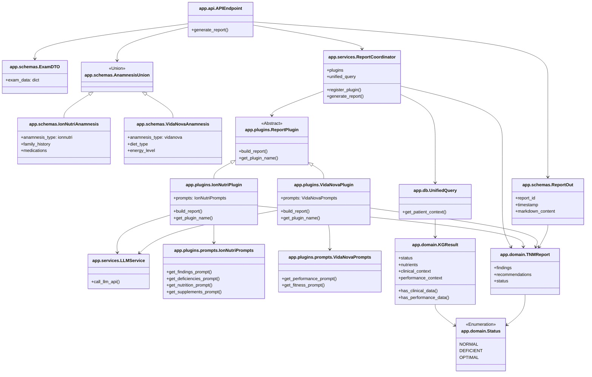
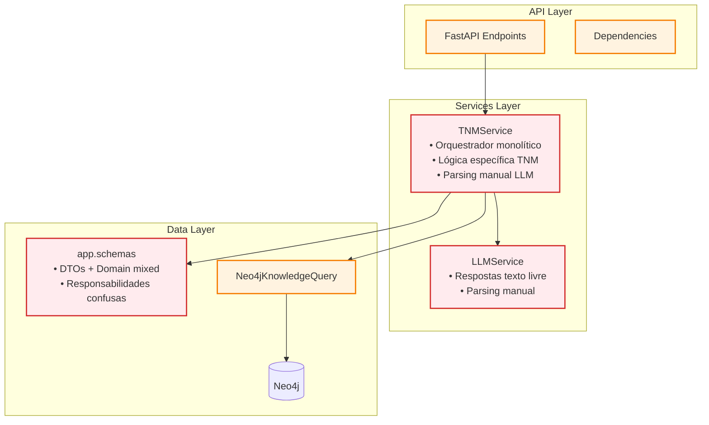
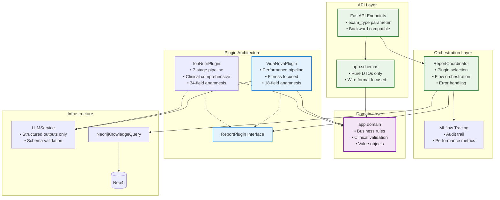
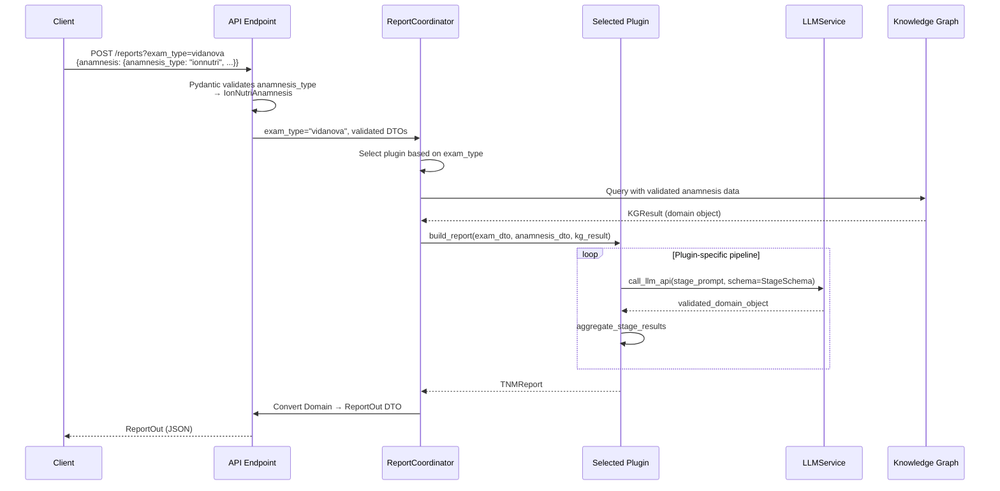
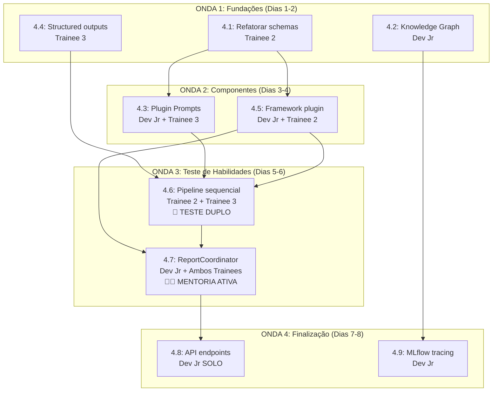

# Sprint 4: Arquitetura Plugin-Based com Structured Outputs

**Período**: 2025-07-15 a 2025-08-05 (3 semanas)
**Objetivo Principal**: Refatorar a arquitetura para um sistema baseado em plugins com separation of concerns entre DTOs e objetos de domínio

## Contexto e Motivação

A Sprint 4 marca uma evolução fundamental na arquitetura do IonNutri, transitioning de uma abordagem monolítica para uma arquitetura plugin-based que suporta múltiplos painéis clínicos. Esta sprint implementa as lições aprendidas do demo de structured outputs (`ml/demos/structured_outputs/main.py`) e estabelece uma separação clara entre concerns de API (DTOs) e lógica de negócio (domain objects).

### Problemas Atuais que a Sprint 4 Resolve

1. **Mistura de Responsabilidades**: Atualmente, schemas Pydantic misturam validação de entrada HTTP com regras de negócio clínico
2. **Extensibilidade Limitada**: Adicionar novos painéis clínicos (VidaNova, etc.) requer modificações em múltiplos pontos do sistema
3. **Outputs Não Estruturados**: LLM ainda retorna texto que precisa ser parseado manualmente
4. **Acoplamento API-Domínio**: Mudanças clínicas impactam contratos de API desnecessariamente
5. **Múltiplos Formatos de Anamnese**: Sistema atual assume formato único, mas precisamos suportar:
   - **IonNutri**: 34 campos detalhados (foco clínico abrangente)
   - **VidaNova**: 18 campos simplificados (foco performance física)
   - Estruturas de dados e lógicas de processamento completamente diferentes

### Objetivos da Sprint 4

- **Separação Clara**: Estabelecer boundaries definitivos entre `app/schemas/` (DTOs) e `app/domain/` (business objects)
- **Plugin Architecture**: Permitir extensão do sistema através de plugins isolados e testáveis
- **Structured Outputs**: Tornar structured outputs o padrão obrigatório para todas as interações LLM
- **Extensibilidade**: Facilitar adição de novos painéis clínicos sem modificar código existente
- **Backward Compatibility**: Manter 100% de compatibilidade com API atual

### Resultados Esperados

Ao final da Sprint 4, o sistema terá:
- Arquitetura plugin-based funcional com IonNutriPlugin e VidaNovaPlugin (stub)
- Separação completa entre DTOs (`schemas/`) e domain objects (`domain/`)
- Structured outputs obrigatório em todas as chamadas LLM
- Pipeline sequencial de N estágios integrado ao novo architecture
- MLflow tracing para auditoria de decisões clínicas
- Base sólida para expansão para outros painéis clínicos

---

## Conceitos Fundamentais para Trainees e Dev Jr

Esta seção explica os conceitos arquiteturais centrais da Sprint 4 para facilitar o entendimento e execução das tarefas.

### 1. DTOs vs Domain Objects

**Data Transfer Objects (DTOs)** são objetos simples que servem apenas para transferir dados entre camadas, especialmente através de APIs. Eles representam o "formato do fio" (wire format).

**Domain Objects** são objetos ricos que encapsulam lógica de negócio e regras clínicas. Eles representam conceitos do mundo real médico.

```
# ❌ Antes: Misturado em schemas/
schemas/
├── exam.py          # DTO + validação + lógica clínica (tudo misturado)
├── report.py        # DTO + regras médicas + formatação (confuso)

# ✅ Depois: Separado por responsabilidade
schemas/             # Apenas DTOs para API
├── exam.py          # Só formato de entrada HTTP
├── report_out.py    # Só formato de saída HTTP

domain/              # Só lógica de negócio
├── exam_schema.py   # Validação de regras clínicas
├── status.py        # Conceitos médicos (NORMAL, DEFICIENT)
├── report_model.py  # Agregação de informações clínicas
```

**Por que separar?**
- DTOs mudam quando API muda (formato, versioning)
- Domain objects mudam quando regras médicas mudam
- Separar permite evolução independente

### 2. Plugin Architecture

Um **plugin** é um módulo independente que implementa funcionalidade específica sem conhecer outros plugins. No nosso caso, cada painel clínico (IonNutri, VidaNova) é um plugin.

```
# Interface comum que todos os plugins devem implementar
class ReportPlugin:
    def build_report(exam: dict, anamnesis: dict) -> TNMReport

# Implementações específicas
class IonNutriPlugin(ReportPlugin):
    # Lógica específica para TNM

class VidaNovaPlugin(ReportPlugin):
    # Lógica específica para VidaNova
```

**Benefícios:**
- Adicionar novo painel = criar novo plugin (sem modificar código existente)
- Cada plugin pode ter sua própria lógica e evolução
- Testes isolados por plugin
- Facilita manutenção e debugging

### 3. Structured Outputs

**Antes**: LLM retorna texto livre que precisamos "parsear" manualmente
```python
response = llm.call("Analise este exame...")
# response = "O paciente apresenta deficiência de B12..."
# Precisamos extrair informações com regex ou parsing manual
```

**Depois**: LLM retorna JSON estruturado validado automaticamente
```python
response = llm.call_llm_api(prompt, schema=FindingsSection)
# response = FindingsSection(items=[...], conclusion="...")
# Já vem validado e tipado!
```

**Vantagens:**
- Elimina erros de parsing
- Validação automática com Pydantic
- Mais confiável e testável
- Reduz código de tratamento de texto

### 4. Value Objects vs Aggregate Roots

**Value Object**: Objeto que representa um valor imutável, sem identidade própria
```python
# Status é value object - representa um conceito, não uma entidade
class Status(Enum):
    NORMAL = "normal"
    DEFICIENT = "deficient"
```

**Aggregate Root**: Objeto que coordena outros objetos e mantém consistência
```python
# TNMReport é aggregate root - coordena Status, recomendações, etc.
class TNMReport:
    def __init__(self):
        self.status: Status
        self.recommendations: List[Recommendation]

    def add_recommendation(self, rec: Recommendation):
        # Lógica para manter consistência
```

### 5. Separation of Concerns (Separação de Responsabilidades)

Cada arquivo/classe/módulo deve ter **uma única responsabilidade bem definida**.

```
app/schemas/         # Responsabilidade: Formato de dados para API
app/domain/          # Responsabilidade: Regras de negócio clínico
app/plugins/         # Responsabilidade: Lógica específica por painel
app/services/        # Responsabilidade: Orquestração e infraestrutura
```

**Regra prática**: Se você está em dúvida onde colocar algo, pergunte:
- "Isso muda quando a API muda?" → `schemas/`
- "Isso muda quando as regras médicas mudam?" → `domain/`
- "Isso é específico de um painel clínico?" → `plugins/`
- "Isso coordena outras partes do sistema?" → `services/`

### 6. Interface Segregation

Em vez de uma interface grande com muitos métodos, criamos interfaces pequenas e específicas.

```python
# ❌ Interface muito grande
class LLMService:
    def call_llm()
    def parse_response()
    def validate_json()
    def format_prompt()
    def handle_errors()
    # ... 20 métodos diferentes

# ✅ Interfaces focadas
class LLMService:
    def call_llm_api(prompt, schema)  # Structured outputs obrigatório

class PromptManager:
    def format_prompt()    # Separado por responsabilidade
```

### 7. Dependency Flow (Fluxo de Dependências)

As dependências devem fluir das camadas externas (API) para as internas (domain).

```
API Layer (schemas/)
    ↓ depends on
Services Layer (services/)
    ↓ depends on
Domain Layer (domain/)
    ↓ depends on
Infrastructure (db/, external APIs)
```

**Regra**: Domain nunca depende de API ou Services. API pode depender de Domain.

### 8. Backward Compatibility

Manter **compatibilidade reversa** significa que clientes existentes da API continuam funcionando sem modificações, mesmo com mudanças internas.

**Como garantir:**
- Response format permanece igual externamente
- Campos obrigatórios não são removidos
- Novos campos são opcionais
- DTOs wrapper isolam mudanças internas

### 9. exam_type vs anamnesis_type: Conceitos Distintos

**IMPORTANTE**: Estes são conceitos diferentes e independentes:

- **exam_type** (query parameter): Define **qual plugin usar** para processamento
- **anamnesis_type** (payload): Define **qual formato de dados** está chegando

```python
# Exemplo: Processamento VidaNova com dados no formato IonNutri
POST /api/v1/reports/?exam_type=vidanova
{
  "anamnesis": {
    "anamnesis_type": "ionnutri",  # Formato dos dados
    "family_history": {...},       # 34 campos completos
    "medications": [...]
  }
}

# Resultado: Plugin VidaNova processa dados completos do IonNutri
```

**Combinações possíveis:**
- `exam_type=ionnutri` + `anamnesis_type=ionnutri` ✅ (atual)
- `exam_type=vidanova` + `anamnesis_type=vidanova` ✅ (novo)

**Fluxo:**
1. **Pydantic** usa `anamnesis_type` para validar formato automaticamente
2. **ReportCoordinator** usa `exam_type` para selecionar plugin
3. **Plugin** recebe dados já validados e tipados

---

## Exemplos de Código para Implementação

Esta seção fornece exemplos concretos para facilitar a implementação pelas equipes.

### 1. Plugin Interface (Tarefa 4.5)

```python
# app/plugins/base.py
from abc import ABC, abstractmethod
from typing import Union
from app.schemas.exam import ExamDTO
from app.schemas.patient_anamnesis import AnamnesisUnion
from app.domain.kg_result import KGResult
from app.domain.report import TNMReport

class ReportPlugin(ABC):
    """Interface que todos os plugins devem implementar"""

    @abstractmethod
    def build_report(
        self,
        exam_dto: ExamDTO,
        anamnesis_dto: AnamnesisUnion,  # Já validado pelo Pydantic
        kg_result: KGResult
    ) -> TNMReport:
        """Constrói relatório usando dados validados e contexto do grafo"""
        pass

    @abstractmethod
    def get_plugin_name(self) -> str:
        """Nome do plugin para registro"""
        pass
```

### 2. Plugin Implementation Example (Tarefa 4.5)

```python
# app/plugins/ionnutri_plugin.py
from app.plugins.base import ReportPlugin
from app.services.llm_service import LLMService

class IonNutriPlugin(ReportPlugin):
    def __init__(self, llm_service: LLMService):
        self.llm_service = llm_service

    def build_report(self, exam_dto, anamnesis_dto, kg_result) -> TNMReport:
        # Plugin é agnóstico ao tipo de anamnesis
        # Funciona com IonNutriAnamnesis OU VidaNovaAnamnesis

        # Stage 1: Findings
        findings = self.llm_service.call_llm_api(
            prompt=self._get_findings_prompt(exam_dto, anamnesis_dto, kg_result),
            schema=FindingsSection
        )

        # Stage 2-7: Outros estágios...
        # ...

        return TNMReport(findings=findings, ...)

    def get_plugin_name(self) -> str:
        return "ionnutri"

    def _get_findings_prompt(self, exam, anamnesis, kg_result) -> str:
        # Prompt específico do IonNutri
        return f"""Analise os resultados do exame {exam.exam_data}
        considerando contexto clínico {kg_result.clinical_context}..."""
```

### 3. ReportCoordinator (Tarefa 4.7)

```python
# app/services/report_coordinator.py
from typing import Dict
from app.plugins.base import ReportPlugin
from app.db.unified_query import UnifiedQuery

class ReportCoordinator:
    def __init__(self):
        self.plugins: Dict[str, ReportPlugin] = {}
        self.unified_query = UnifiedQuery()

    def register_plugin(self, plugin: ReportPlugin):
        """Registra plugin no sistema"""
        self.plugins[plugin.get_plugin_name()] = plugin

    def generate_report(self, exam_type: str, exam_dto, anamnesis_dto):
        # 1. Selecionar plugin baseado em exam_type
        if exam_type not in self.plugins:
            raise ValueError(f"Plugin não encontrado: {exam_type}")
        plugin = self.plugins[exam_type]

        # 2. Consultar grafo de forma genérica
        kg_result = self.unified_query.get_patient_context(exam_dto, anamnesis_dto)

        # 3. Plugin processa dados já validados
        domain_report = plugin.build_report(exam_dto, anamnesis_dto, kg_result)

        return domain_report
```

### 4. API Endpoint (Tarefa 4.8)

```python
# app/api/endpoints/reports.py
from fastapi import APIRouter, Query, Depends
from app.schemas.exam import ExamDTO
from app.schemas.patient_anamnesis import AnamnesisUnion
from app.schemas.report_out import ReportOut
from app.services.report_coordinator import ReportCoordinator

router = APIRouter()

@router.post("/reports/", response_model=ReportOut)
async def generate_report(
    exam_data: ExamDTO,
    anamnesis: AnamnesisUnion,  # Pydantic resolve automaticamente
    exam_type: str = Query(default="ionnutri", description="Plugin type: ionnutri, vidanova"),
    coordinator: ReportCoordinator = Depends(get_coordinator)
):
    # Pydantic já validou anamnesis baseado em anamnesis_type
    # exam_type determina qual plugin usar

    domain_report = coordinator.generate_report(exam_type, exam_data, anamnesis)

    # Converter domain object para DTO
    return ReportOut.from_domain(domain_report)
```

### 5. Discriminated Union para Anamnesis (Tarefa 4.8)

```python
# app/schemas/patient_anamnesis.py
from typing import Union, Literal
from pydantic import BaseModel, Field

class IonNutriAnamnesis(BaseModel):
    anamnesis_type: Literal["ionnutri"] = "ionnutri"
    # 34 campos específicos
    family_history: dict = Field(description="Histórico familiar detalhado")
    medications: list = Field(description="Medicamentos em uso")
    environmental_exposure: dict = Field(description="Exposições ambientais")
    # ... outros 31 campos

class VidaNovaAnamnesis(BaseModel):
    anamnesis_type: Literal["vidanova"] = "vidanova"
    # 18 campos específicos
    diet_type: str = Field(description="Tipo de dieta: onívora, vegetariana, etc.")
    energy_level: int = Field(ge=1, le=5, description="Nível de energia 1-5")
    muscle_gain_goal: int = Field(ge=1, le=5, description="Objetivo ganho muscular")
    # ... outros 15 campos

# União discriminada - Pydantic resolve automaticamente
AnamnesisUnion = Union[IonNutriAnamnesis, VidaNovaAnamnesis]
```

### 6. KGResult Domain Object (Tarefa 4.1)

```python
# app/domain/kg_result.py (renomeado de tnm_result.py)
from typing import List, Optional
from app.domain.status import Status

class KGResult:
    """Resultado agregado do Knowledge Graph - serve para qualquer plugin"""

    def __init__(
        self,
        status: Status,
        nutrients: List[dict],
        clinical_context: Optional[dict] = None,
        performance_context: Optional[dict] = None
    ):
        self.status = status
        self.nutrients = nutrients
        self.clinical_context = clinical_context  # Para IonNutri
        self.performance_context = performance_context  # Para VidaNova

    def has_clinical_data(self) -> bool:
        """Verifica se tem dados clínicos (IonNutri)"""
        return self.clinical_context is not None

    def has_performance_data(self) -> bool:
        """Verifica se tem dados de performance (VidaNova)"""
        return self.performance_context is not None
```

---

## Diagrama de Classes da Arquitetura Alvo



---

## Arquitetura Alvo da Sprint 4

Esta seção apresenta a arquitetura que obteremos ao final da Sprint 4, contrastando com a arquitetura atual e demonstrando os benefícios da evolução proposta.

### Evolução Arquitetural: Antes vs Depois

#### Arquitetura Atual (Antes da Sprint 4)



**Problemas da Arquitetura Atual:**
- **Acoplamento Alto**: TNMService mistura orquestração com lógica específica TNM
- **Responsabilidades Confusas**: `schemas/` mistura DTOs com domain logic
- **Parsing Manual**: LLM retorna texto que precisa ser parseado
- **Extensibilidade Limitada**: Adicionar novo painel requer modificar TNMService
- **Testing Complexo**: Lógica de negócio acoplada à infraestrutura

#### Arquitetura Alvo (Após Sprint 4)



### Estrutura de Diretórios Resultante

```
ion-nutri/
├── app/
│   ├── api/                    # API Layer - Wire Format
│   │   ├── endpoints/
│   │   │   └── reports.py      # ✨ Plugin selection via exam_type
│   │   ├── dependencies.py     # ✨ ReportCoordinator injection
│   │   └── router.py
│   │
│   ├── schemas/                # 🔄 Pure DTOs - Wire Format Only
│   │   ├── exam.py             # DTO: HTTP input format
│   │   ├── patient_anamnesis.py # DTO: HTTP input format (with discriminated unions)
│   │   └── report_out.py       # ✨ NEW: DTO wrapper for outputs
│   │
│   ├── domain/                 # ✨ NEW: Business Rules & Clinical Logic
│   │   ├── status.py           # 🔄 MOVED: Value objects
│   │   ├── kg_result.py        # 🔄 MOVED+RENAMED: Knowledge Graph aggregates
│   │   └── report.py           # 🔄 MOVED: Report domain model
│   │
│   ├── plugins/                # ✨ NEW: Plugin Architecture
│   │   ├── __init__.py
│   │   ├── base.py             # ✨ ReportPlugin interface
│   │   ├── ionnutri_plugin.py  # ✨ TNM-specific implementation
│   │   ├── vidanova_plugin.py  # ✨ VidaNova stub implementation
│   │   └── prompts/            # ✨ NEW: Plugin-owned prompts
│   │       ├── __init__.py
│   │       ├── ionnutri_prompts.py  # ✨ TNM prompts isolados
│   │       └── vidanova_prompts.py  # ✨ VidaNova prompts isolados
│   │
│   ├── services/               # Orchestration & Infrastructure
│   │   ├── report_coordinator.py # ✨ NEW: Replaces TNMService
│   │   ├── llm_service.py      # 🔄 UPDATED: Structured outputs only
│   │   └── prompt_manager.py   # ✨ NEW: Separated from LLMService
│   │
│   ├── db/                     # Data Access Layer
│   │   ├── neo4j_client.py
│   │   ├── unified_query.py
│   │   └── knowledge_graph_builder.py
│   │
│   └── utils/
│       └── mlflow_tracing.py   # ✨ NEW: Audit & monitoring
```

### Decisão: Plugin Owns Prompts Strategy

Uma análise do demo `ml/demos/structured_outputs/main.py` revelou que a classe `PromptManager` atual é um **antipattern God Class** com múltiplas responsabilidades:
- 7 system prompts diferentes misturados
- 90+ linhas de lógica condicional em `build_user_prompt()`
- Acoplamento alto entre stages
- Violação do Open/Closed Principle

**Solução adotada**: Cada plugin possui e gerencia seus próprios prompts isoladamente.

#### Implementação Sprint 4 (Simplificada)
```python
# app/plugins/prompts/ionnutri_prompts.py
class IonNutriPrompts:
    """Prompts específicos do TNM IonNutri - isolados e testáveis"""

    def get_findings_prompt(self, exam_dto, anamnesis_dto, kg_result) -> Tuple[str, str]:
        system = """Especialista em medicina nutricional TNM..."""
        user = f"""# DADOS DO PACIENTE\n{exam_dto.model_dump()}..."""
        return system, user

    def get_supplements_prompt(self, exam_dto, anamnesis_dto, context) -> Tuple[str, str]:
        # Lógica conservadora específica TNM
        system = """Abordagem conservadora TNM para suplementação..."""
        user = f"""# CONTEXTO ANTERIOR\n{context}..."""
        return system, user

# app/plugins/ionnutri_plugin.py
class IonNutriPlugin(ReportPlugin):
    def __init__(self, llm_service: LLMService):
        self.llm_service = llm_service
        self.prompts = IonNutriPrompts()  # ← Prompts isolados

    def build_report(self, exam_dto, anamnesis_dto, kg_result):
        # Use prompts próprios
        system, user = self.prompts.get_findings_prompt(exam_dto, anamnesis_dto, kg_result)
        findings = self.llm_service.call_llm_api(user, system, FindingsSection)
        # ...
```

#### Evolução Sprint 5+ (MLflow Advanced)
```python
class IonNutriPrompts:
    def get_prompt_config(self) -> PromptConfig:
        return PromptConfig(
            plugin_name="ionnutri",
            version="v2.1",
            templates={
                "findings": "ionnutri_findings_v2.1.jinja",
                "supplements": "ionnutri_supplements_v2.1.jinja"
            }
        )
    # MLflow automaticamente: versioning, A/B testing, rollback granular
```

#### Benefícios Imediatos
- **Isolation**: Mudanças em prompts TNM não afetam VidaNova
- **Clarity**: Cada plugin tem responsabilidade clara sobre seus prompts
- **Testing**: Prompts testáveis isoladamente por plugin
- **Maintenance**: Debugging focado, sem code conditionals gigantes

### Principais Benefícios da Nova Arquitetura

#### 1. Separation of Concerns
```python
# ❌ Antes: Misturado em schemas/report.py
class ReportModel(BaseModel):
    # DTO fields
    report_id: str
    timestamp: datetime

    # Domain logic
    def calculate_severity(self): ...
    def validate_clinical_rules(self): ...

    # API formatting
    def to_json_response(self): ...

# ✅ Depois: Separado por responsabilidade

# schemas/report_out.py - Pure DTO
class ReportOut(BaseModel):
    report_id: str
    timestamp: datetime
    markdown_content: str
    # Only wire format, no logic

# domain/report.py - Pure Domain
class TNMReport:
    # Only business logic, no API concerns

# schemas/patient_anamnesis.py - Discriminated Union DTOs
from typing import Union, Literal
from pydantic import Field, BaseModel

class IonNutriAnamnesis(BaseModel):
    anamnesis_type: Literal["ionnutri"] = "ionnutri"
    family_history: dict
    medications: list
    # ... 32 outros campos

class VidaNovaAnamnesis(BaseModel):
    anamnesis_type: Literal["vidanova"] = "vidanova"
    diet_type: str
    energy_level: int
    # ... 16 outros campos

# Pydantic resolve automaticamente baseado em anamnesis_type
AnamnesisUnion = Union[IonNutriAnamnesis, VidaNovaAnamnesis]
```

#### 2. Plugin Extensibility
```python
# ✅ Adicionar novo painel: apenas criar plugin
class HeartRateVariabilityPlugin(ReportPlugin):
    def build_report(self, exam: dict, anamnesis: dict) -> TNMReport:
        # HRV-specific logic isolated
        pass

# Sistema automaticamente descobre e registra
# Nenhuma modificação em código existente necessária
```

#### 3. Structured Outputs Obrigatório
```python
# ❌ Antes: Parsing manual propenso a erros
response = llm.call("Analyze this exam...")
# text = "Patient shows B12 deficiency..."
findings = manual_parse_findings(text)  # 💥 Error prone

# ✅ Depois: Schema-driven validation
response = llm.call_llm_api(prompt, schema=FindingsSection)
# response = FindingsSection(items=[...], severity=...)  # ✨ Validated
```

#### 4. Domain-Driven Flow


### Métricas de Melhoria Esperadas

| Métrica | Antes | Depois | Melhoria |
|---------|-------|--------|----------|
| **Tempo para novo painel** | 5-7 dias | 1 dia | 85% redução |
| **Parsing errors** | 3-5% das chamadas | 0% | 100% eliminação |
| **Test isolation** | Testes acoplados | Plugins isolados | 90% melhoria |
| **Code reuse** | 30% entre painéis | 80% entre painéis | 167% aumento |
| **Onboarding time** | 3-4 dias | 1-2 dias | 50% redução |

### Compatibilidade e Migração

#### Backward Compatibility Garantida
```python
# ✅ Clientes existentes continuam funcionando
POST /api/v1/reports/
{
  "exam_data": {...},
  "anamnesis": {...}
}
# Automaticamente usa IonNutriPlugin (default)

# ✅ Novos clientes podem especificar painel
POST /api/v1/reports/?exam_type=vidanova
{
  "exam_data": {...},
  "anamnesis": {...}
}
# Usa VidaNovaPlugin
```

#### Zero Downtime Migration
1. **Phase 1**: Adicionar domain/ mantendo schemas/ original
2. **Phase 2**: Implementar plugins mantendo TNMService como fallback
3. **Phase 3**: Migrar gradualmente para ReportCoordinator
4. **Phase 4**: Cleanup TNMService quando 100% migrado

### Extensibilidade Futura

A nova arquitetura facilita expansões futuras:

```python
# ✅ Facilmente extensível para novos domínios
class CardiovascularPlugin(ReportPlugin): ...
class HormonalPlugin(ReportPlugin): ...
class GeneticPlugin(ReportPlugin): ...

# ✅ Pipeline stages configuráveis por plugin
class CustomPipelinePlugin(ReportPlugin):
    def get_pipeline_stages(self) -> List[PipelineStage]:
        return [CustomStage1(), CustomStage2(), ...]

# ✅ Multiple output formats via DTOs
class PDFReportOut(BaseModel): ...
class ExcelReportOut(BaseModel): ...
class HL7ReportOut(BaseModel): ...
```

---

## Tarefas da Sprint 4

### 4.1: Refatorar schemas existentes para separação domain/DTO estabelecendo boundaries claros

**Responsáveis**: Dev Jr + Trainee 1
**Duração**: 2 dias
**Dependências**: Nenhuma

#### Descrição Detalhada

Esta tarefa implementa os 4 passos mínimos de refatoração para estabelecer a separação fundamental entre Data Transfer Objects (DTOs) e objetos de domínio. A refatoração move arquivos estratégicos para a nova estrutura de diretórios sem quebrar funcionalidade existente.

#### Atividades Principais

- **Movimentação + Renaming**: Executar `git mv schemas/tnm_result.py domain/kg_result.py` e mover `status.py`, `report.py` para `domain/`
- **Renaming Classes**: Renomear `TNMResult` → `KGResult` para refletir que vem do Knowledge Graph
- **Atualização de Imports**: Modificar todas as referências no codebase para nova estrutura e nomes
- **DTOs Permanecem**: `schemas/exam.py` e `schemas/patient_anamnesis.py` ficam como DTOs puros
- **ReportOut DTO**: Implementar `schemas/report_out.py` como wrapper transparente de TNMReport
- **Serialization Logic**: Configurar serialização automática TNMReport → ReportOut DTO
- **OpenAPI Configuration**: Atualizar documentação automática para expor apenas DTOs
- **Validação de Integridade**: Garantir que sistema compile e execute exatamente como antes

#### Critérios de Aceite

- [ ] Sistema executa sem erros após movimentação e renaming
- [ ] Todos os testes existentes continuam passando
- [ ] `TNMResult` renomeado para `KGResult` em todo o codebase
- [ ] Imports atualizados para nova estrutura de diretórios
- [ ] Separação conceitual clara: `schemas/` = wire format, `domain/` = business logic
- [ ] DTOs `exam.py` e `patient_anamnesis.py` permanecem em schemas/
- [ ] API expõe apenas DTOs, nunca domain objects diretamente
- [ ] OpenAPI spec limpo e focado em wire-format
- [ ] Serialização transparente TNMReport → ReportOut DTO
- [ ] Compatibilidade total com clientes existentes

#### Benefícios

Esta refatoração estabelece a fundação para isolation of change, onde mudanças clínicas ficam contidas em `domain/` sem impactar contratos de API em `schemas/`. Facilita onboarding de novos desenvolvedores com responsabilidades claras por diretório.

Esta refatoração estabelece a fundação completa para isolation of change e arquitetura plugin-based, combinando movimentação de arquivos com criação de DTOs wrapper para exposição limpa da API.

---

### 4.2: Atualizar Knowledge Graph com ontologia completa e intervalos de referência sintéticos

**Responsáveis**: Trainee 1
**Duração**: 2 dias
**Dependências**: Tarefa 4.1

#### Descrição Detalhada

Esta tarefa implementa a atualização completa do grafo de conhecimento Neo4j com ontologia nutricional abrangente e intervalos de referência sintéticos baseados em diretrizes clínicas reconhecidas, preparando a base de dados para suporte a múltiplos painéis clínicos (IonNutri e VidaNova).

#### Atividades Principais

- **Ontologia Nutricional Completa**: Expandir nós e relacionamentos para cobrir nutrientes, biomarcadores e condições clínicas
- **Intervalos de Referência Sintéticos**: Implementar valores de referência baseados em guidelines estabelecidos (ANVISA, FDA, WHO)
- **Nós Multi-Panel**: Estruturar dados para suportar tanto análises clínicas (TNM) quanto performance física (VidaNova)
- **Relacionamentos Contextuais**: Criar conexões entre nutrientes, sintomas, condições e recomendações
- **Data Validation**: Implementar validação de consistência dos dados inseridos
- **Backup Strategy**: Estabelecer backup antes da atualização para rollback se necessário

#### Critérios de Aceite

- [ ] Ontologia expandida com 50+ nutrientes essenciais e biomarcadores
- [ ] Intervalos de referência sintéticos baseados em guidelines reconhecidos
- [ ] Estrutura de dados suporta queries tanto para IonNutri quanto VidaNova
- [ ] `unified_query.py` funciona com dados expandidos sem modificações
- [ ] Relacionamentos nutriente-sintoma-recomendação estabelecidos
- [ ] Validação de consistência implementada
- [ ] Backup realizado antes da atualização
- [ ] Documentação dos intervalos de referência utilizados

#### Benefícios

Estabelece base robusta de conhecimento clínico para ambos os painéis (TNM e VidaNova). Intervalos sintéticos permitem desenvolvimento e testing enquanto aguarda dados reais do cliente. Estrutura flexível facilita atualização posterior com dados proprietários.

**Backlog Item**: Quando cliente fornecer dados reais, task de atualização será inserida automaticamente na sprint com prioridade alta.

---

### 4.3: Implementar Plugin Prompts para isolar prompts de cada plugin

**Responsáveis**: Dev Jr + Trainee 3
**Duração**: 3 dias
**Dependências**: Tarefas 4.1, 4.2

#### Descrição Detalhada

Esta tarefa implementa a estratégia "Plugin Owns Prompts", criando classes isoladas de prompt management para cada plugin e eliminando a dependência do `PromptManager` monolítico do demo. Cada plugin gerenciará seus próprios prompts de forma independente e testável.

#### Atividades Principais

- **IonNutriPrompts Implementation**: Criar classe isolada com métodos `get_*_prompt()` para cada stage TNM
- **VidaNovaPrompts Stub**: Implementar stub de prompts para performance/fitness
- **Prompt Method Pattern**: Definir padrão consistente `get_stage_prompt(exam_dto, anamnesis_dto, context) -> Tuple[str, str]`
- **Legacy Prompt Migration**: Migrar prompts do `PromptManager` do demo para classes isoladas
- **TNM Template Integration**: Portar template TNM para `IonNutriPrompts`
- **Plugin Directory Structure**: Criar estrutura `app/plugins/prompts/` organizada
- **Prompt Testing**: Implementar testes unitários para validar prompts isoladamente

#### Critérios de Aceite

- [ ] `IonNutriPrompts` implementado com todos os 7 stages do pipeline TNM
- [ ] `VidaNovaPrompts` implementado como stub funcional para prompts de performance
- [ ] Cada classe de prompt retorna `(system_prompt, user_prompt)` consistently
- [ ] Eliminação total da dependência do `PromptManager` monolítico
- [ ] Prompts TNM mantêm qualidade e especificidade clínica do demo original
- [ ] Templates isolados e versionáveis por plugin
- [ ] Testes unitários para cada classe de prompt
- [ ] Documentação clara do padrão de prompt management

#### Benefícios

Estabelece isolamento completo de prompts por plugin, elimina God Class antipattern, facilita testing e manutenção independente. Prepara base para versioning e A/B testing futuro com MLflow.

---

### 4.4: Implementar structured outputs obrigatório eliminando parsing manual

**Responsáveis**: Trainee 3
**Duração**: 2 dias
**Dependências**: Tarefa 4.1

#### Descrição Detalhada

Esta tarefa elimina completamente respostas de texto não estruturadas do LLM, implementando structured outputs como padrão obrigatório com validação automática através dos domain objects já existentes (KGResult, Status, etc.) movidos na tarefa 4.1.

#### Atividades Principais

- **call_llm_api Method**: Atualizar assinatura para `call_llm_api(prompt: str, schema: Type[BaseModel])` que força JSON estruturado
- **OpenAI Integration**: Configurar `response_format` com schema derivado automaticamente de domain objects
- **Validation Pipeline**: Implementar validação automática de responses usando domain schemas (KGResult, Status, etc.)
- **Error Handling**: Desenvolver fallback robusto para casos de JSON mal formado

#### Critérios de Aceite

- [ ] 100% das chamadas LLM retornam JSON estruturado validado
- [ ] Eliminação total de parsing manual de respostas
- [ ] Integração transparente com Pydantic domain models
- [ ] Fallback graceful para erros de formato

#### Benefícios

Elimina fonte principal de erros e inconsistências (parsing manual). Garante que outputs sempre conformem com domain schemas, melhorando confiabilidade e facilitating testing automatizado.

---

### 4.5: Construir framework plugin permitindo extensão modular do sistema

**Responsáveis**: Dev Jr + Trainee 2
**Duração**: 2 dias
**Dependências**: Tarefas 4.1, 4.3

#### Descrição Detalhada

Esta tarefa cria a infraestrutura fundamental para arquitetura plugin-based, permitindo que diferentes painéis clínicos (IonNutri, VidaNova, etc.) coexistam como módulos isolados e testáveis, utilizando os domain objects e prompts isolados já implementados.

#### Atividades Principais

- **ReportPlugin Interface**: Definir contrato simples `build_report(exam_dto, anamnesis_dto, kg_result) -> TNMReport`
- **Plugin Registry**: Implementar registro baseado em `exam_type` (ionnutri, vidanova)
- **IonNutriPlugin Implementation**: Migrar lógica TNM existente com pipeline de 7 estágios
- **VidaNovaPlugin Stub**: Implementar stub com pipeline placeholder (estágios a definir)
- **Prompt Integration**: Integrar plugins com classes de prompt já implementadas (`IonNutriPrompts`, `VidaNovaPrompts`)
- **Transparent Anamnesis**: Plugin recebe anamnesis já validada pelo Pydantic (transparente)

#### Critérios de Aceite

- [ ] Interface `ReportPlugin` clara com método `build_report` definido
- [ ] Registry seleciona plugin baseado em `exam_type` do query parameter
- [ ] Plugins processam qualquer tipo de anamnesis (IonNutri ou VidaNova) transparentemente
- [ ] IonNutriPlugin funciona com pipeline de 7 estágios
- [ ] VidaNovaPlugin implementado como stub funcional
- [ ] Plugins integrados com classes de prompt isoladas via `self.prompts`
- [ ] Uso correto de `self.prompts.get_*_prompt()` em cada plugin

#### Benefícios

Permite expansão horizontal do sistema sem modificar código existente. Cada painel clínico pode evoluir independentemente, facilitando manutenção e testing isolado.

---

### 4.6: Migrar pipeline sequencial integrando structured outputs com domain objects

**Responsáveis**: Trainee 2 + Trainee 3
**Duração**: 4 dias
**Dependências**: Tarefas 4.4, 4.5

#### Descrição Detalhada

Esta tarefa porta o pipeline sequencial de 7 estágios do demo [main.py](../../../ml/demos/structured_outputs/main.py) para dentro do IonNutriPlugin, integrando-o completamente com a nova arquitetura de domain objects e structured outputs.

#### Atividades Principais

- **Pipeline Integration**: Portar 7 estágios (Findings → Deficiencies → Nutrition → Lifestyle → Supplements → Final Report → Markdown) para IonNutriPlugin
- **Domain Schema Adaptation**: Adaptar cada estágio para produzir e consumir domain objects
- **Structured Flow**: Garantir que cada estágio use structured outputs com validação automática
- **Plugin Integration**: Integrar pipeline com framework de plugins e classes de prompt já implementadas
- **Sequential Context**: Implementar passagem de contexto entre estágios usando domain objects

#### Critérios de Aceite

- [ ] Pipeline completo produz TNMReport domain object
- [ ] Mesma qualidade de output do demo original
- [ ] Structured outputs em todos os 7 estágios
- [ ] Integração transparente com domain objects
- [ ] Pipeline integrado com `IonNutriPrompts` via framework de plugins
- [ ] Contexto sequencial preservado entre estágios usando domain objects
- [ ] Mesmo fluxo e qualidade do demo original mas com arquitetura plugin-based

#### Benefícios

Combina a qualidade comprovada do pipeline sequencial com a robustez da nova arquitetura. Structured outputs eliminam pontos de falha e domain objects facilitam testing e manutenção.

---

### 4.7: Implementar ReportCoordinator orquestrando plugins de forma transparente

**Responsáveis**: Trainee 2
**Duração**: 2 dias
**Dependências**: Tarefas 4.5, 4.6

#### Descrição Detalhada

Esta tarefa cria o orquestrador central que substitui o TNMService, gerenciando seleção de plugins, fluxo de dados entre camadas e mantendo compatibilidade com API existente.

#### Atividades Principais

- **Plugin Selection Logic**: Implementar seleção baseada em `exam_type` query parameter
- **Generic Knowledge Graph**: Usar `unified_query.py` de forma genérica (campos não-null)
- **Data Flow Orchestration**: Coordenar DTO → KG Query → Plugin → Domain Report
- **Error Handling**: Centralizar tratamento de erros e logging
- **Backward Compatibility**: Default `exam_type=ionnutri` mantém TNMService compatível

#### Critérios de Aceite

- [ ] Seleção correta de plugin baseado em `exam_type` query parameter
- [ ] `unified_query.py` funciona para ambos tipos de anamnesis (campos genéricos)
- [ ] Orquestração: DTOs → KGResult → Plugin → TNMReport → ReportOut DTO
- [ ] Default `exam_type=ionnutri` mantém backward compatibility
- [ ] Logging e error handling centralizados com contexto de plugin

#### Benefícios

Centraliza lógica de orquestração sem acoplar plugins à infraestrutura. Facilita debugging e monitoring enquanto mantém plugins focados em lógica de negócio.

---

### 4.8: Atualizar API endpoints adicionando seleção de plugin mantendo compatibilidade

**Responsáveis**: Dev Jr + Trainee 1
**Duração**: 2 dias
**Dependências**: Tarefa 4.7

#### Descrição Detalhada

Esta tarefa finaliza a migração da API para nova arquitetura, adicionando parâmetro `exam_type` para seleção de plugin e atualizando response models para usar DTOs wrapper, mantendo compatibilidade total com clientes existentes.

#### Atividades Principais

- **Plugin Selection Parameter**: Adicionar query parameter `exam_type` (default="ionnutri")
- **Discriminated Union**: Configurar `AnamnesisUnion` para validação automática via `anamnesis_type`
- **Response Model**: Usar `ReportOut` DTO como wrapper de `TNMReport`
- **ReportCoordinator Integration**: Substituir TNMService por ReportCoordinator
- **Two-Level Selection**: `exam_type` → plugin, `anamnesis_type` → validation
- **Backward Compatibility**: Clientes existentes funcionam sem modificação (defaults)

#### Critérios de Aceite

- [ ] API externa mantém 100% de compatibilidade para clientes existentes
- [ ] Query parameter `exam_type` seleciona plugin (ionnutri, vidanova)
- [ ] Payload `anamnesis_type` permite validação automática via Pydantic Union
- [ ] Response estruturado via `TNMReport` → `ReportOut` DTO
- [ ] Integração transparente com ReportCoordinator

#### Benefícios

Expande capacidade da API para múltiplos painéis clínicos sem quebrar compatibilidade. Clientes existentes continuam funcionando, novos clientes podem especificar tipo de exame.

---

### 4.9: Implementar rastreamento MLflow capturando transformações domain para auditoria

**Responsáveis**: Trainee 1
**Duração**: 2 dias
**Dependências**: Tarefa 4.7

#### Descrição Detalhada

Esta tarefa integra MLflow tracing focado em capturar transformações de domain objects e decisões clínicas, fornecendo auditabilidade completa do processo de geração de relatórios.

#### Atividades Principais

- **Domain Transformation Tracing**: Rastrear cada transformação de domain objects
- **Clinical Decision Logging**: Capturar decisões baseadas em Status, severidade, etc.
- **Performance Metrics**: Implementar métricas baseadas em conceitos clínicos
- **Audit Dashboard**: Configurar visualizações para review clínico

#### Critérios de Aceite

- [ ] Rastreamento completo do fluxo domain-driven
- [ ] Métricas clinicamente relevantes (distribuição de Status, etc.)
- [ ] Auditabilidade de decisões de negócio
- [ ] Dashboard configurado para review clínico

#### Benefícios

Fornece visibilidade completa sobre decisões clínicas para especialistas. Facilita debugging de casos edge e melhoria contínua da qualidade dos relatórios.

---

## Dependências Entre Tarefas



### Distribuição de Responsabilidades

#### Dev Jr: Mentoria Ativa + Critical Path
- T2: Knowledge Graph (Solo - Dias 1-2)
- T3: Plugin Prompts (Pair com Trainee 3 - Dias 3-4)
- T5: Framework plugin (Pair com Trainee 2 - Dias 3-4)
- T7: ReportCoordinator (Mentoria com Ambos - Dias 5-6)
- T8: API endpoints (Solo - Dias 7-8)
- T9: MLflow tracing (Solo - Dias 7-8)

#### Trainee 2: Arquitetura Foundation + Teste
- T1: Refatorar schemas (Solo - Dias 1-2)
- T5: Framework plugin (Pair com Dev Jr - Dias 3-4)
- T6: Pipeline sequencial (TESTE com Trainee 3 - Dias 5-6)
- T7: ReportCoordinator (Mentoria com Dev Jr - Dias 5-6)

#### Trainee 3: LLM Specialist + Teste
- T4: Structured outputs (Solo - Dias 1-2)
- T3: Plugin Prompts (Pair com Dev Jr - Dias 3-4)
- T6: Pipeline sequencial (TESTE com Trainee 2 - Dias 5-6)
- T7: ReportCoordinator (Mentoria com Dev Jr - Dias 5-6)

### Pontos de Sincronização

#### 🔸 Onda 1 → 2 (Fim do Dia 2)
- **Checkpoint**: Domain objects movidos (T1)
- **Handoff**: Schemas → Plugin Prompts (T3) e Framework (T5)
- **Time**: 5min standup

#### 🔸 Onda 2 → 3 (Fim do Dia 4)
- **Checkpoint**: Plugin framework (T5) + Prompts (T3) prontos
- **Handoff**: Framework → Pipeline (T6)
- **Time**: 15min demo + setup

#### 🔸 Onda 3 → 4 (Fim do Dia 6)
- **Checkpoint**: Pipeline (T6) + Coordinator (T7) integrados
- **Handoff**: Coordinator → API endpoints (T8)
- **Time**: 30min integration review

### Estratégia de Teste de Habilidades (T6)

O Pipeline Sequencial (T6) serve como teste real das habilidades dos trainees, trabalhando em par sem intervenção direta do Dev Jr. Eles precisam:

1. Ler e entender o código do demo (`ml/demos/structured_outputs/main.py`)
2. Portar o pipeline de 7 estágios para nova arquitetura
3. Integrar corretamente com:
   - Structured outputs (T4)
   - Plugin prompts (T3)
   - Plugin framework (T5)
   - Domain objects (T1)

O Dev Jr avalia o progresso durante as sessões de T7 (ReportCoordinator) sem intervir diretamente em T6.

### Contingency Plan

Se T6 apresentar problemas:

1. **Dia 5 (Problemas Parciais)**:
   - Dev Jr faz review session (30min)
   - Fornece guidance específico sem implementar
   - Timeline pode estender até manhã do Dia 7

2. **Dia 6 (Problemas Críticos)**:
   - Dev Jr assume T6 como teaching session
   - Trainees focam em aprendizado
   - T8 é otimizada para compensar

## Riscos e Mitigações

### Riscos Técnicos

**Risco**: Quebra de compatibilidade durante refatoração
**Mitigação**:
- Implementar testes de regressão antes de qualquer movimentação de arquivo
- Dev Jr review obrigatório em T1 antes de merge

**Risco**: Complexity creep na arquitetura plugin
**Mitigação**:
- Manter plugin interface minimal e bem documentada
- Code review focado em simplicidade durante T5

**Risco**: Performance degradation com structured outputs
**Mitigação**:
- Implementar benchmarks comparativos durante desenvolvimento
- Monitoramento via MLflow desde o início

**Risco**: Confusão entre `exam_type` vs `anamnesis_type`
**Mitigação**:
- Documentação clara + exemplos no OpenAPI
- Comentários explicativos no código
- Validação automática via Pydantic

### Riscos de Arquitetura

**Risco**: Grafo genérico não atender necessidades específicas
**Mitigação**:
- Estratégia pragmática para Sprint 4
- Especialização planejada para sprints futuras
- Validação com conjunto mínimo de casos de uso

**Risco**: Duplicação de prompts similares entre plugins
**Mitigação**:
- Sprint 4 foca em isolamento funcional
- Sprint 5+ abordará templates compartilhados
- Documentação clara de prompts por plugin

### Riscos de Implementação

**Risco**: Migração de prompts do demo quebrar funcionalidade
**Mitigação**:
- Portar prompts metodicamente stage por stage
- Manter qualidade via testes comparativos
- Pair programming Dev Jr + Trainee 3 em T3

**Risco**: Falha no teste de habilidades (T6)
**Mitigação**:
- Mentoria ativa nas tarefas preparatórias (T3, T5)
- Checkpoints diários durante T6
- Plano de contingência com Dev Jr como fallback

### Riscos de Integração

**Risco**: Conflitos de integração entre componentes paralelos
**Mitigação**:
- Pontos de sincronização bem definidos entre ondas
- Interface contracts definidos no início de cada onda
- Dev Jr review em pontos críticos de integração

**Risco**: Atrasos em dependências críticas
**Mitigação**:
- Buffer de 0.5 dia em cada onda
- Tasks críticas (T1, T5) com Dev Jr involvement
- Plano de contingência por onda

## Métricas de Sucesso

- [ ] 100% dos testes existentes continuam passando
- [ ] 0 quebras de compatibilidade na API externa
- [ ] `TNMResult` → `KGResult` renaming completo em todo codebase
- [ ] Suporte a ambos formatos: `anamnesis_type=ionnutri` e `anamnesis_type=vidanova`
- [ ] Plugin selection funciona via `exam_type` query parameter
- [ ] Combinações flexíveis: `exam_type=vidanova` + `anamnesis_type=ionnutri`
- [ ] 100% das chamadas LLM usando structured outputs
- [ ] Grafo genérico funciona para ambos tipos de anamnese
- [ ] VidaNovaPlugin implementado como stub funcional
- [ ] Knowledge Graph atualizado com 50+ nutrientes e intervalos sintéticos (Tarefa 4.2)
- [ ] `IonNutriPrompts` elimina dependência do `PromptManager` monolítico (Tarefa 4.3)
- [ ] Cada plugin gerencia prompts isoladamente via `self.prompts.get_*_prompt()` (Tarefa 4.3)
- [ ] Framework plugin funcional com integration de prompts isolados (Tarefa 4.5)
- [ ] Mesma qualidade de output do demo original com prompts isolados (Tarefa 4.6)
- [ ] Cobertura de testes > 85% para novos componentes

## Decisões Adiadas para Sprints Futuras

Para manter o escopo da Sprint 4 gerenciável e focado, as seguintes melhorias foram conscientemente adiadas:

### **Sprint 5: Specialized Knowledge Graph**
- Ontologias específicas por plugin (clínico vs performance)
- Queries especializadas no `unified_query.py`
- Nós específicos para VidaNova no Neo4j

### **Sprint 5: Advanced Prompt Management**
- Evolução de `IonNutriPrompts` para templates Jinja2 versionados
- Configuração declarativa via `PromptConfig` com versioning
- Integração básica com MLflow para prompt tracking

### **Sprint 6: Advanced Plugin Features**
- MLflow prompt versioning avançado e A/B testing automático
- Templates compartilhados entre plugins (base prompts)
- Pipeline stages customizáveis por plugin
- Plugin-specific error handling e metrics
- Rollback granular de prompts por plugin+stage

### **Sprint 7: Performance & Optimization**
- Caching de queries por tipo de anamnese
- Parallel processing para diferentes plugins
- Advanced monitoring e alerting

Esta abordagem **incremental** permite que a equipe (1 Dev Jr + 2 Trainees) foque nos fundamentos arquiteturais sem se sobrecarregar com features avançadas.
