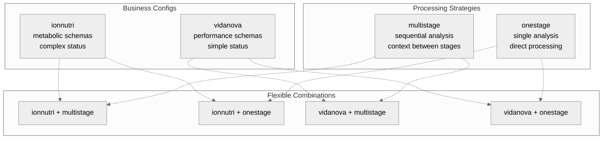
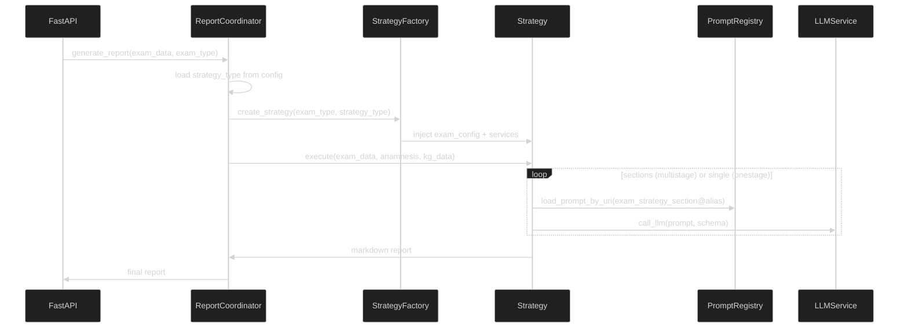

# Technical Overview - N-Layer Architecture with Strategy Pattern

**Migration from plugins to Strategy Pattern with MLflow registry/evaluation for 1 junior + 2 trainees team.**

## Architecture

### N-Layer Structure
```
Presentation  → FastAPI endpoints (unchanged)
Application   → ReportCoordinator + StrategyFactory
Strategy      → MultiStage/OneStage strategies
Services      → LLM + PromptRegistry + KnowledgeGraph
Domain        → ExamConfigs + Models (unchanged)
Data          → Neo4j queries (unchanged)
```

### Core Separation: exam_type vs strategy_type

**exam_type** = Business configuration (ionnutri, vidanova)
**strategy_type** = Processing approach (multistage, onestage)

**Key Insight**: Any exam_type can use any strategy_type via dependency injection.



## Strategy Pattern Implementation

### Base Classes
```python
class BaseExamConfig(ABC):
    @abstractmethod
    def get_section_schemas() -> Dict[str, Type[BaseModel]]: pass
    @abstractmethod
    def get_status_mapping() -> Dict[str, Any]: pass
    @abstractmethod
    def get_exam_type() -> str: pass

class BaseReportStrategy(ABC):
    def __init__(self, exam_config: BaseExamConfig, services: dict):
        self.exam_config = exam_config  # Injected via constructor
        self.llm_service = services["llm"]
        self.prompt_registry = services["prompts"]

    @abstractmethod
    def execute(self, exam_data, anamnesis, kg_data) -> str: pass
```

### Factory Pattern
```python
class StrategyFactory:
    def __init__(self):
        self.exam_configs = {
            "ionnutri": IonNutriConfig(),
            "vidanova": VidaNovaConfig()
        }
        self.strategy_classes = {
            "multistage": MultiStageReportStrategy,
            "onestage": OneStageReportStrategy
        }

    def create_strategy(self, exam_type: str, strategy_type: str, services: dict):
        exam_config = self.exam_configs[exam_type]
        strategy_class = self.strategy_classes[strategy_type]
        return strategy_class(exam_config=exam_config, services=services)
```

## MLflow Integration

### Prompt Registry
**URI Pattern**: `prompts:/{exam_type}_{strategy_type}_{section}@{alias}`

**Examples**:
- `prompts:/ionnutri_multistage_findings@production`
- `prompts:/vidanova_onestage_complete@latest`

**Aliases**: `@production`, `@staging`, `@latest`

```python
class MLflowPromptRegistry(BasePromptRegistry):
    def load_prompt_by_uri(self, prompt_uri: str) -> str:
        uri_without_prefix = prompt_uri[9:]  # Remove 'prompts:/'
        prompt_path, alias = uri_without_prefix.split("@")

        model_version = self.client.get_model_version_by_alias(
            name=f"prompt_{prompt_path}",
            alias=alias
        )

        artifact_path = self.client.download_artifacts(
            run_id=model_version.run_id,
            path="prompt_template.txt"
        )

        with open(artifact_path, 'r') as f:
            return f.read()
```

### Evaluation System
**MLflow GenAI metrics** for A/B testing prompt variants.

```python
class MLflowPromptEvaluator(BasePromptEvaluator):
    def evaluate(self, strategy_results: dict, test_data: list) -> dict:
        """
        Args:
            strategy_results: {"multistage": [result1, result2], "onestage": [...]}
            test_data: List of test cases for comparison
        Returns:
            {"multistage": {"score": 4.235, "metrics": {...}}, "onestage": {...}}
        """
        scorers = [
            mlflow.metrics.genai.answer_correctness(),
            mlflow.metrics.genai.answer_similarity(),
            mlflow.metrics.genai.make_genai_metric(
                name="medical_completeness",
                definition="Medical recommendations completeness",
                grading_prompt="Rate completeness (1-5): diet, supplements, training"
            )
        ]

        results = {}
        for strategy_name, outputs in strategy_results.items():
            eval_result = mlflow.evaluate(
                data=test_data,
                predictions=outputs,
                evaluators=scorers
            )
            results[strategy_name] = {
                "score": eval_result.metrics["aggregate_score"],
                "metrics": eval_result.metrics
            }

        return results
```

## Strategy Execution Flow

### MultiStage Strategy
```python
class MultiStageReportStrategy(BaseReportStrategy):
    def execute(self, exam_data, anamnesis, kg_data) -> str:
        sections = self.exam_config.get_section_schemas()
        results = []
        context = {"exam_data": exam_data, "anamnesis": anamnesis, "kg_data": kg_data}

        # Sequential processing with context accumulation
        for section_name, schema in sections.items():
            prompt_uri = f"{self.exam_config.get_exam_type()}_multistage_{section_name}@{self.alias}"
            prompt = self.prompt_registry.load_prompt_by_uri(prompt_uri)

            result = self.llm_service.call_llm(
                prompt=prompt.format(**context, previous_sections=results),
                schema=schema
            )

            results.append(result)
            context[f"{section_name}_result"] = result

        # Final markdown generation
        markdown_uri = f"{self.exam_config.get_exam_type()}_multistage_markdown@{self.alias}"
        markdown_prompt = self.prompt_registry.load_prompt_by_uri(markdown_uri)

        return self.llm_service.call_llm(
            prompt=markdown_prompt.format(**context, section_results=results),
            schema=None  # Free text markdown
        )
```

### OneStage Strategy
```python
class OneStageReportStrategy(BaseReportStrategy):
    def execute(self, exam_data, anamnesis, kg_data) -> str:
        # Single comprehensive prompt
        prompt_uri = f"{self.exam_config.get_exam_type()}_onestage_complete@{self.alias}"
        prompt = self.prompt_registry.load_prompt_by_uri(prompt_uri)

        context = {
            "exam_data": exam_data,
            "anamnesis": anamnesis,
            "kg_data": kg_data,
            "formatting_rules": self.exam_config.get_formatting_config()
        }

        # Single LLM call with composite schema
        result = self.llm_service.call_llm(
            prompt=prompt.format(**context),
            schema=self.exam_config.get_complete_report_schema()
        )

        # Direct markdown generation
        markdown_uri = f"{self.exam_config.get_exam_type()}_onestage_markdown@{self.alias}"
        markdown_prompt = self.prompt_registry.load_prompt_by_uri(markdown_uri)

        return self.llm_service.call_llm(
            prompt=markdown_prompt.format(**context, complete_result=result),
            schema=None
        )
```

## Production Integration

### ReportCoordinator Update
```python
class ReportCoordinator:
    def __init__(self, strategy_factory: StrategyFactory, kg_service: KnowledgeGraphService):
        self.strategy_factory = strategy_factory
        self.kg_service = kg_service
        self.config = self._load_strategy_config()  # YAML: ionnutri -> multistage

    def generate_report(self, exam_data: ExamData, anamnesis: PatientAnamnesis, exam_type: str) -> str:
        kg_data = self.kg_service.get_knowledge_data(exam_data, anamnesis)
        strategy_type = self.config['strategies'][exam_type]['type']

        strategy = self.strategy_factory.create_strategy(exam_type, strategy_type, {
            "llm": self.llm_service,
            "prompts": self.prompt_registry,
            "kg": self.kg_service
        })

        return strategy.execute(exam_data, anamnesis, kg_data)
```

### Configuration Management
**strategy_config.yaml**:
```yaml
strategies:
  ionnutri:
    type: multistage  # Based on evaluation results
  vidanova:
    type: onestage    # Optimized for speed
```

## File Structure Migration

### New Structure
```
app/domain/exam_configs/
├── base_config.py          # BaseExamConfig
├── ionnutri_config.py      # ← metabolite_constants.py
└── vidanova_config.py      # ← vidanova_constants.py

app/services/report/
├── base.py                 # BaseReportStrategy
├── multistage_strategy.py  # Reusable strategy
├── onestage_strategy.py    # Reusable strategy
└── strategy_factory.py     # Combinatorial factory

app/services/llm/
├── llm_service.py          # BaseLLMService + OpenRouterLLMService
├── prompt_registry.py     # BasePromptRegistry + MLflowPromptRegistry
└── prompt_evaluator.py    # BasePromptEvaluator + MLflowPromptEvaluator

app/services/kg/
└── kg_service.py           # KnowledgeGraphService bridge
```

### Removed
```
app/plugins/                # Complete removal
app/constants/              # Migrated to exam_configs
app/validators/             # Integrated into db/knowledge_graph_builder.py
app/utils/markdown_generator.py  # Unused
app/utils/template_loader.py     # Unused
```

## Development Workflow

### Basic Flow
```bash
# Status check
uv run python prompt_dev.py status --exam-type ionnutri

# Evaluate all strategies
uv run python prompt_dev.py evaluate --exam-type ionnutri --all-strategies

# Promote best version
uv run python prompt_dev.py promote --exam-type ionnutri --strategy-type multistage
```

### Template Structure
```
ml/prompt_templates/
├── ionnutri/
│   ├── multistage/          # findings, nutrition, summary
│   └── onestage/            # complete
└── vidanova/
    ├── multistage/          # performance, recovery, training
    └── onestage/            # complete
```

## Sequence Diagram


## Benefits

- **Combinatorial flexibility**: Any exam_type + strategy_type
- **MLflow integration**: Versioned prompts, A/B testing, rollback
- **Dependency injection**: Testable, configurable strategies
- **Clean separation**: Business config vs processing logic
- **Type safety**: Python 3.12 type hints throughout
- **Extensibility**: New clients add config, reuse strategies
