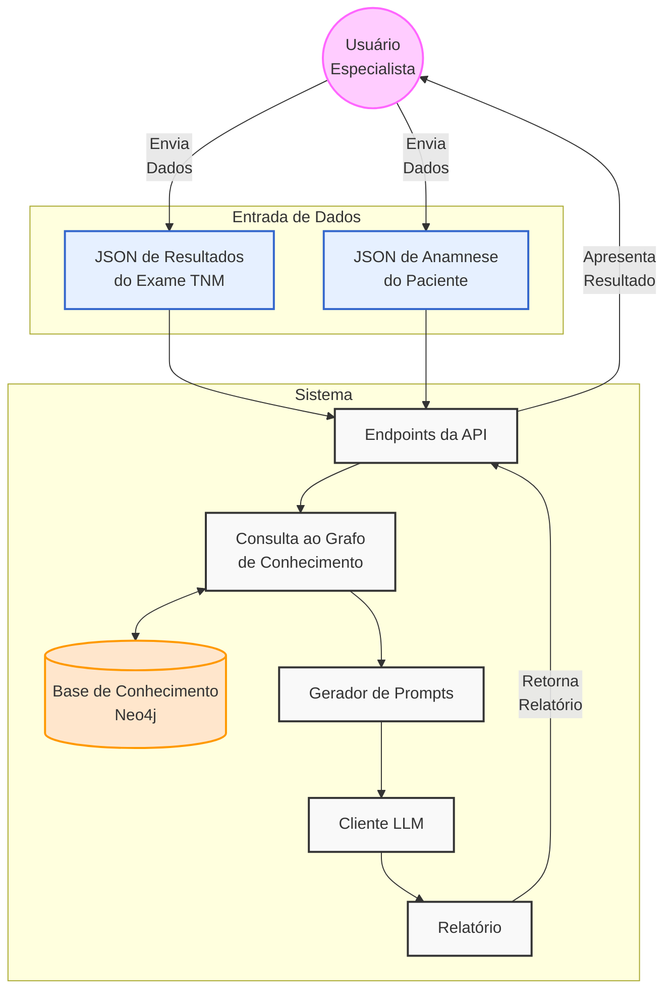
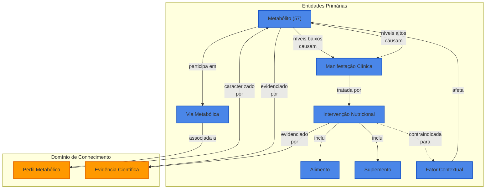
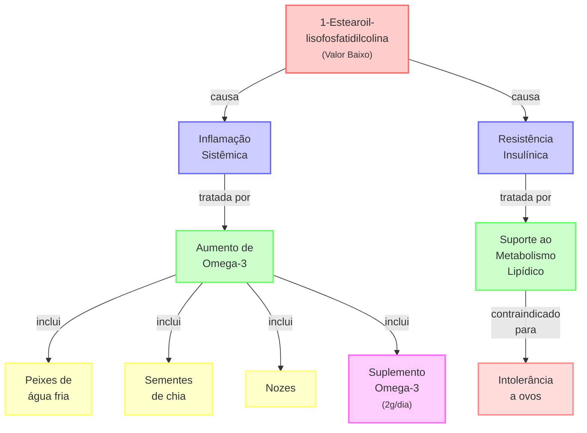

# Apresentação: Automação do Relatório TNM
## Data: 13/05/2025

---

## 1. O Problema Atual

### Processo Manual (40 minutos por relatório)
- Análise manual dos 57 metabólitos
- Interpretação individual de cada resultado
- Criação manual das recomendações
- Risco de inconsistências
- Gargalo na produtividade

### Impacto no Negócio
- Tempo valioso dos especialistas consumido em tarefas repetitivas
- Escalabilidade limitada
- Potencial para inconsistências entre relatórios
- Custo operacional elevado

---

## 2. Nossa Solução Técnica

### Visão Geral
> "Um sistema especializado que transforma dados nutrimetabólicos normalizados em relatórios personalizados utilizando conhecimento estruturado e modelos de linguagem."



### Tecnologias Principais
1. **Grafos de Conhecimento (Neo4j)**
   - Base de conhecimento estruturada em grafos
   - Representação natural de relações complexas
   - Consultas eficientes para extração de conhecimento
   - Escalável e flexível para evolução do conhecimento

2. **Modelos de Linguagem (LLMs)**
   - Claude 3.7 Sonnet / OpenAI GPT-4
   - Geração de texto natural e estruturado
   - Compreensão profunda do contexto
   - Adaptação a diferentes estilos de comunicação

3. **API REST (FastAPI)**
   - Interface moderna e eficiente
   - Documentação automática (OpenAPI/Swagger)
   - Validação robusta de dados
   - Alta performance e escalabilidade

---

## 3. Estrutura Ontológica do Conhecimento Nutri-Metabólico

### Visão Geral da Ontologia
> "Uma modelagem semântica dos 57 metabólitos, suas interrelações, manifestações clínicas e intervenções nutricionais baseadas em evidências."



### Componentes Chave da Ontologia

1. **Entidades Clínicas Relevantes**
   - **Metabólitos**: 57 moléculas específicas, incluindo 28 exclusivas da Ion Nutri
   - **Vias Metabólicas**: Ciclos bioquímicos, vias reguladoras e de sinalização
   - **Manifestações**: Sintomas e condições associadas a níveis alterados
   - **Intervenções**: Abordagens terapêuticas nutricionais personalizadas

2. **Atributos Clínicos Detalhados**
   - **Metabólitos**: Faixas de referência específicas, significado clínico
   - **Manifestações**: Gravidade, cronicidade, mecanismos fisiológicos
   - **Intervenções**: Duração recomendada, resultados esperados, contraindicações
   - **Alimentos/Suplementos**: Dosagens, frequências, alternativas, avisos

3. **Padrões Semânticos Aplicados**
   - **Diagnóstico**: Identificação estruturada de desequilíbrios a partir dos resultados
   - **Recomendação Personalizada**: Adaptação contextual com base no perfil do paciente
   - **Identificação de Perfis**: Reconhecimento de padrões metabólicos complexos

### Benefícios Clínicos da Abordagem Ontológica

1. **Precisão Diagnóstica**
   - Interpretação consistente e padronizada dos 57 metabólitos
   - Contextualização com histórico clínico e fatores individuais
   - Identificação de padrões metabólicos complexos não evidentes em análise isolada

2. **Recomendações Baseadas em Evidências**
   - Cada relação metabólito-intervenção fundamentada em literatura científica
   - Priorização de condutas com maior nível de evidência
   - Documentação completa das fontes para revisão por especialistas

3. **Personalização Contextualizada**
   - Adaptação das recomendações considerando
     * Histórico médico
     * Medicamentos em uso
     * Intolerâncias alimentares
     * Indicadores antropométricos
   - Exclusão automática de intervenções contraindicadas ao perfil

4. **Expansão do Conhecimento**
   - Ontologia extensível para incorporação de novos biomarcadores
   - Sistema de versionamento para atualizações do conhecimento científico
   - Rastreabilidade de todas as recomendações até a fonte de evidência

## 4. Fluxo de Dados

### Entrada do Sistema
1. **Dados do Exame TNM**
   ```json
   {
     "patient_id": "PT12345",
     "exam_date": "2025-04-15",
     "metabolites": [
       {
         "name": "1-Estearoil-lisofosfatidilcolina",
         "value": 0.085,
         "unit": "μM"
       }
       // ... outros 56 metabólitos
     ]
   }
   ```

2. **Anamnese do Paciente**
   ```json
   {
     "patient_id": "PT12345",
     "personal_data": {
       "age": 45,
       "gender": "male",
       "weight": 78,
       "height": 165,
       "bmi": 28.5
     },
     "context_factors": {
       "medical_history": ["Histórico familiar de doenças cardiovasculares"],
       "intolerances": ["Intolerância a ovos"],
       "medications": [{"name": "Omeprazol", "frequency": "ocasional"}]
     }
   }
   ```

### Exemplo de Consulta ao Neo4j (Grafo de Conhecimento)



Quando o exame mostra que o metabólito "1-Estearoil-lisofosfatidilcolina" está baixo, nosso sistema faz uma consulta simples ao grafo:

```
// Em português simples: "Encontre todas as intervenções recomendadas
// quando o metabólito X está baixo, incluindo os alimentos e suplementos,
// mas exclua as contraindicadas para este paciente"

MATCH (m:Metabolito {nome: "1-Estearoil-lisofosfatidilcolina"})
MATCH (m)-[:NIVEIS_BAIXOS_CAUSAM]->(s:Sintoma)
MATCH (s)-[:TRATADO_POR]->(i:Intervencao)
MATCH (i)-[:INCLUI]->(r)
WHERE r:Alimento OR r:Suplemento
AND NOT EXISTS {
  MATCH (i)-[:CONTRAINDICADO_PARA]->(f:FatorContextual)
  WHERE f.nome IN ["Intolerância a ovos"]
}
RETURN r.nome, r.tipo, r.dosagem, r.frequencia
```

Resultado desta consulta:
| Nome | Tipo | Dosagem | Frequência |
|------|------|---------|------------|
| Peixes de água fria | Alimento | 100g | 3x por semana |
| Sementes de chia | Alimento | 1 colher de sopa | Diária |
| Nozes | Alimento | 30g | 3-4x por semana |
| Omega-3 (EPA/DHA) | Suplemento | 2g | Diária |

> *A consulta ao grafo permite ao sistema "seguir os caminhos" entre entidades relacionadas, como se estivesse navegando em uma rede de conhecimento interconectado - similar ao raciocínio de um especialista clínico.*


### Exemplo de Prompt para LLM

O sistema transforma o conhecimento estruturado do grafo em prompts para o LLM:

```
Contexto:
- Paciente: homem, 45 anos, IMC 28.5
- Histórico: Doenças cardiovasculares na família
- Intolerâncias: Ovos
- Medicamentos: Omeprazol (ocasional)

Metabólitos alterados:
1. 1-Estearoil-lisofosfatidilcolina
   - Valor: 0.085 μM (Baixo - Referência: 0.1-0.3 μM)
   - Via afetada: Metabolismo de fosfolipídios
   - Sintomas associados: Inflamação sistêmica, resistência insulínica
   - Intervenções indicadas:
     * Alimentos: Peixes de água fria, sementes de chia, nozes
     * Suplementos: Ômega-3 (2g/dia)

2. [Outros metabólitos relevantes]

Tarefa:
Gere uma seção de recomendações nutricionais personalizadas para o paciente com base nos desequilíbrios metabólicos identificados. As recomendações devem:
1. Ser agrupadas por categoria (energéticos, construtores, etc.)
2. Considerar as contraindicações e intolerâncias
3. Priorizar alimentos sobre suplementos quando possível
4. Explicar brevemente a relação com o desequilíbrio metabólico
5. Usar linguagem acessível mas precisa

Formato de saída: JSON estruturado conforme a especificação do relatório.
```

### Saída do Sistema
```json
{
  "patient_id": "PT12345",
  "report_id": "f47ac10b-58cc-4372-a567-0e02b2c3d479",
  "timestamp": "2025-05-05T14:32:16.789Z",
  "version": "1.0",
  "summary": "...",
  "findings": {
    "items": [
      {
        "metabolite": "1-Estearoil-lisofosfatidilcolina",
        "status": "baixo",
        "description": "...",
        "implications": ["..."]
      }
    ],
    "conclusion": "..."
  },
  "recommendations": {
    "nutritional": {
      "energeticos": [...],
      "construtores": [...],
      "reguladores": [...],
      "gorduras": [...]
    },
    "supplements": [...],
    "lifestyle": [...]
  }
}
```

---

*Apresentação técnica preparada para a Ion Nutri - Maio 2025*
