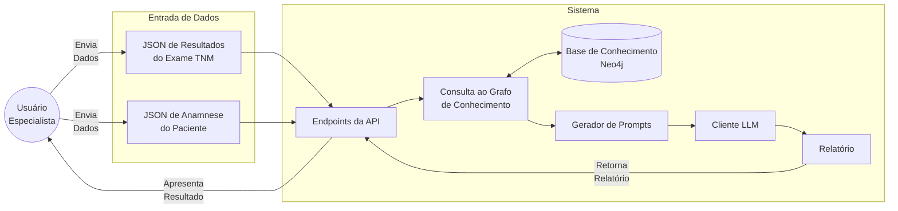
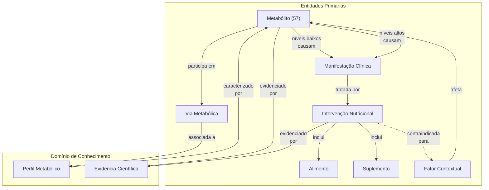

# Automação do Relatório TNM
## Warley Vital
### warley.barbosa@edge.ufal.br
## 13/05/2025

---

# O Problema Atual

### Processo Manual (40 minutos por relatório)
- Análise manual dos 57 metabólitos
- Interpretação individual de cada resultado
- Criação manual das recomendações
- Risco de inconsistências
- Gargalo na produtividade

### Impacto no Negócio
- Tempo valioso dos especialistas consumido em tarefas repetitivas
- Escalabilidade limitada
- Potencial para inconsistências entre relatórios
- Custo operacional elevado

---

# Nossa Solução Técnica


### Visão Geral
> "Um sistema especializado que transforma dados nutrimetabólicos normalizados em relatórios personalizados utilizando conhecimento estruturado e modelos de linguagem."

<br>




---

# Tecnologias Principais


1. **Grafos de Conhecimento (Neo4j)**
   - Base de conhecimento estruturada em grafos
   - Representação natural de relações complexas
   - Consultas eficientes para extração de conhecimento
   - Escalável e flexível para evolução do conhecimento

---


# Tecnologias Principais

2. **Modelos de Linguagem (LLMs)**
   - Claude 3.7 Sonnet / OpenAI GPT-4.1 / Gemini 2.5 ou Flash
   - Geração de texto natural e estruturado
   - Compreensão profunda do contexto
   - Adaptação a diferentes estilos de comunicação

---

# Tecnologias Principais

3. **API REST (FastAPI)**
   - Interface moderna e eficiente
   - Documentação automática (OpenAPI/Swagger)
   - Validação robusta de dados
   - Alta performance e escalabilidade

---

# Estrutura Ontológica do Conhecimento Nutri-Metabólico

<div class="grid grid-cols-2 gap-4">
<div>

### Visão Geral da Ontologia

<br>

> "Uma modelagem semântica dos 57 metabólitos, suas interrelações, manifestações clínicas e intervenções nutricionais baseadas em evidências."


</div>
<div>



</div>
</div>

---

# Componentes Chave da Ontologia

1. **Entidades Clínicas Relevantes**
   - **Metabólitos**: 57 moléculas específicas, incluindo 28 exclusivas da Ion Nutri
   - **Vias Metabólicas**: Ciclos bioquímicos, vias reguladoras e de sinalização
   - **Manifestações**: Sintomas e condições associadas a níveis alterados
   - **Intervenções**: Abordagens terapêuticas nutricionais personalizadas

2. **Atributos Clínicos Detalhados**
   - **Metabólitos**: Faixas de referência específicas, significado clínico
   - **Manifestações**: Gravidade, cronicidade, mecanismos fisiológicos
   - **Intervenções**: Duração recomendada, resultados esperados, contraindicações
   - **Alimentos/Suplementos**: Dosagens, frequências, alternativas, avisos

---

# Benefícios Clínicos da Abordagem Ontológica

1. **Precisão Diagnóstica**
   - Interpretação consistente e padronizada dos 57 metabólitos
   - Contextualização com histórico clínico e fatores individuais
   - Identificação de padrões metabólicos complexos
---

# Benefícios Clínicos da Abordagem Ontológica

2. **Recomendações Baseadas em Evidências**
   - Cada relação metabólito-intervenção fundamentada em literatura científica
   - Priorização de condutas com maior nível de evidência
   - Documentação completa das fontes

---

# Benefícios Clínicos da Abordagem Ontológica

3. **Personalização Contextualizada**
   - Adaptação das recomendações considerando:
     * Histórico médico
     * Medicamentos em uso
     * Intolerâncias alimentares
     * Indicadores antropométricos

---

# Benefícios Clínicos da Abordagem Ontológica

4. **Expansão do Conhecimento**
   - Ontologia extensível para novos biomarcadores
   - Sistema de versionamento para atualizações
   - Rastreabilidade das recomendações

---

# Fluxo de Dados

### Visão Geral do Processo

<br>

> "Transformação estruturada de dados nutrimetabólicos em recomendações personalizadas através de um pipeline de processamento inteligente."

<br>

- Entrada de dados: JSON de resultados do exame TNM e JSON de anamnese do paciente
- Processamento: Consulta ao grafo de conhecimento
- Saída: Relatório personalizado com recomendações nutricionais

---

# Entrada de Dados: Exame TNM

### Estrutura dos Dados do Exame
```json
{
  "patient_id": "PT12345",
  "exam_date": "2025-04-15",
  "metabolites": [
    {
      "name": "1-Estearoil-lisofosfatidilcolina",
      "value": 0.085,
      "unit": "μM"
    }
  ]
}
```

### Características
- 57 metabólitos analisados
- Valores numéricos com unidades
- Data do exame para contexto temporal

---


# Entrada de Dados: Anamnese do Paciente

<div class="grid grid-cols-2 gap-4">
<div>

### Estrutura dos Dados Pessoais
```json
{
  "patient_id": "PT12345",
  "personal_data": {
    "age": 45,
    "gender": "male",
    "weight": 78,
    "height": 165,
    "bmi": 28.5
  },
  "context_factors": {
    "medical_history": ["Histórico familiar de doenças cardiovasculares"],
    "intolerances": ["Intolerância a ovos"],
    "medications": [{"name": "Omeprazol", "frequency": "ocasional"}]
  }
}
```

</div>
<div>

### Elementos Contextuais
- Dados antropométricos
- Histórico médico
- Intolerâncias alimentares
- Medicamentos em uso

</div>
</div>

---

# Processamento: Consulta ao Grafo de Conhecimento

### Exemplo de Consulta Neo4j
```cypher
MATCH (m:Metabolito {nome: "1-Estearoil-lisofosfatidilcolina"})
MATCH (m)-[:NIVEIS_BAIXOS_CAUSAM]->(s:Sintoma)
MATCH (s)-[:TRATADO_POR]->(i:Intervencao)
MATCH (i)-[:INCLUI]->(r)
WHERE r:Alimento OR r:Suplemento
AND NOT EXISTS {
  MATCH (i)-[:CONTRAINDICADO_PARA]->(f:FatorContextual)
  WHERE f.nome IN ["Intolerância a ovos"]
}
RETURN r.nome, r.tipo, r.dosagem, r.frequencia
```

### Lógica da Consulta
- Identifica metabólito alterado
- Encontra sintomas associados
- Busca intervenções recomendadas
- Filtra contraindicações
- Retorna alimentos e suplementos

---

# Processamento: Resultado da Consulta

### Dados Retornados
| Nome | Tipo | Dosagem | Frequência |
|------|------|---------|------------|
| Peixes de água fria | Alimento | 100g | 3x por semana |
| Sementes de chia | Alimento | 1 colher de sopa | Diária |
| Nozes | Alimento | 30g | 3-4x por semana |
| Omega-3 (EPA/DHA) | Suplemento | 2g | Diária |

### Características do Resultado
- Recomendações personalizadas
- Dosagens específicas
- Frequências definidas
- Exclusão de contraindicações

---

# Processamento: Geração de Prompt para LLM

### Estrutura do Prompt
```
Contexto:
- Paciente: homem, 45 anos, IMC 28.5
- Histórico: Doenças cardiovasculares na família
- Intolerâncias: Ovos
- Medicamentos: Omeprazol (ocasional)

Metabólitos alterados:
1. 1-Estearoil-lisofosfatidilcolina
   - Valor: 0.085 μM (Baixo - Referência: 0.1-0.3 μM)
   - Via afetada: Metabolismo de fosfolipídios
   - Sintomas associados: Inflamação sistêmica, resistência insulínica
   - Intervenções indicadas:
     * Alimentos: Peixes de água fria, sementes de chia, nozes
     * Suplementos: Ômega-3 (2g/dia)

Tarefa:
Gere uma seção de recomendações nutricionais personalizadas...
```

---

# Saída do Sistema

### Estrutura do Relatório
```json {*}{maxHeight:'400px'}
{
  "patient_id": "PT12345",
  "report_id": "f47ac10b-58cc-4372-a567-0e02b2c3d479",
  "timestamp": "2025-05-05T14:32:16.789Z",
  "version": "1.0",
  "summary": "...",
  "findings": {
    "items": [
      {
        "metabolite": "1-Estearoil-lisofosfatidilcolina",
        "status": "baixo",
        "description": "...",
        "implications": ["..."]
      }
    ],
    "conclusion": "..."
  },
  "recommendations": {
    "nutritional": {
      "energeticos": [...],
      "construtores": [...],
      "reguladores": [...],
      "gorduras": [...]
    },
    "supplements": [...],
    "lifestyle": [...]
  }
}
```

---

# Obrigado!

*Apresentação técnica preparada para a Ion Nutri - Maio 2025*
